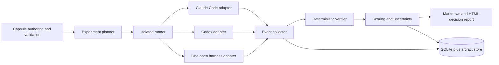

# BenchMe Project Knowledge Base

> Status: working source of truth  
> Last reviewed: 2026-07-11  
> Scope: product thesis, evidence, evaluation methodology, MVP boundaries, architecture, and unresolved research  
> Intended readers: founder, engineers, research agents, customer-facing collaborators

## 1. How to use this document

This document is the starting point for BenchMe. It synthesizes:

1. The referenced ChatGPT conversation `6a453a4a-b274-83eb-9270-4a204c35f85c`, including the evolving product thesis, career objective, and the discussion about native versus augmented agent evaluation.
2. The first research tier in [`dev_workbench_research_docs/`](../dev_workbench_research_docs/00_INDEX_AND_RESEARCH_MAP.md).
3. The newer researcher report in [`research/`](../research/README.md), including every raw workstream in [`research/_raw/`](../research/_raw/).
4. A narrow July 2026 verification pass on agent-harness effects, direct competitors, and relevant implementation technologies.
5. The July 10 coding-benchmark research package in [`benchme_coding_benchmarks_research_2026-07-10/`](../benchme_coding_benchmarks_research_2026-07-10/README.md): a 123-source methodological review, 27-family landscape, source ledger, and implementation schemas.

The conversation is useful context but not independent evidence. The local research is broad, but some market figures are vendor-interested, secondary, or explicitly flagged for re-verification. Use this precedence order:

1. Reproduced BenchMe experiment or direct customer evidence.
2. Primary technical source, official documentation, filing, or controlled study.
3. Multiple credible independent sources.
4. Vendor claim or credible secondary synthesis.
5. Anecdote, community complaint, or internal inference.

Every future product claim should be tagged as one of:

- **Established:** strong external or reproduced evidence.
- **Observed:** directly measured by BenchMe, with configuration and provenance.
- **Hypothesis:** plausible but unvalidated.
- **Decision:** chosen product or engineering direction, subject to a named revisit trigger.
- **Unknown:** unresolved and potentially decision-changing.

## 2. Executive position

### Current thesis

BenchMe should be a **local-first evaluation-assurance and continuous-calibration system for AI-assisted software engineering**.

It should answer:

> Which model, coding-agent harness, context strategy, tool configuration, and verification policy works for this repository and task class, at what total cost and risk?

This is more precise than “repo benchmarking.” The score belongs to a complete configuration, not a model:

```text
observed performance = f(
  task,
  repo state,
  model,
  harness,
  prompt,
  supplied context,
  native context behavior,
  tools,
  permissions,
  budget,
  environment,
  verifier,
  trial
)
```

This framing is supported by recent harness research. [Harness-Bench](https://arxiv.org/abs/2605.27922) argues for reporting capability at the model-harness configuration level. [Claw-SWE-Bench](https://arxiv.org/abs/2606.12344) reports that, under fixed models, harness choice changed Pass@1 by 27.4 percentage points while model choice changed it by 29.4 points; an adapter change moved one fixed-model result from 19.1% to 73.4%. These are new preprints, not immutable laws, but they make “model-only leaderboard” an indefensible product abstraction.

### Recommended entry and expansion

```text
credible public evidence
  -> paid/design-partner calibration engagement
  -> local-first benchmark CLI
  -> continuous configuration regression testing
  -> live outcome correlation
  -> verification and policy artifacts
  -> routing integration, if customers need it
```

The first sellable outcome is a **decision report**, not a dashboard and not a router:

- what works natively;
- which configuration changes materially help or hurt;
- which tasks are safe to delegate;
- what each solved task costs;
- what remains unverified;
- what the team should buy, configure, allow, or avoid.

### What BenchMe should not be

- Another AI IDE or coding agent.
- A generic LLM gateway.
- A generic per-prompt router.
- A public model leaderboard as the business.
- A PR-review comment bot.
- A worktree/best-of-N orchestrator as the wedge.
- A general LLM observability platform.
- A full enterprise control plane in v1.

These exclusions follow the original thesis ([tier-1 thesis](../dev_workbench_research_docs/01_CURRENT_PROJECT_THESIS.md)), the newer competitive analysis ([competitive landscape](../research/02_competitive_landscape.md)), and the MVP scorecard ([MVP options](../research/07_mvp_options_scorecard.md)).

## 3. Product goals and success criteria

BenchMe has two legitimate goals that should be tracked separately.

### Commercial goal

Prove that engineering leaders will pay for repo-specific evidence when choosing, renewing, configuring, or governing AI development tools.

Commercial success is not “people like the report.” It is one of:

- a paid pilot;
- a design partner committing repo access and engineering time;
- a renewal/procurement decision materially changed by the evidence;
- recurring payment for re-calibration after configuration or model changes.

### Career and technical-signal goal

Produce a credible flagship artifact for agentic AI, AI engineering, FDE, and evaluation roles. It must demonstrate:

- reliable orchestration of real coding agents;
- experimental design and evaluation discipline;
- reproducible execution environments;
- deterministic and probabilistic verification;
- trace and cost instrumentation;
- clear customer-facing decision output;
- honest handling of uncertainty.

This means a vertical technical slice should be built in parallel with customer discovery, even if the commercial strategy is service-led. A pure consulting deck would validate demand but underperform the career objective; a technically elaborate harness with no buyer evidence would do the opposite.

## 4. What the research establishes—and what it does not

### Established enough to guide the project

1. **Public scores do not answer a private-repo procurement question.** Public benchmarks remain useful for broad screening, but contamination, reward hacking, weak oracles, saturation, and transfer gaps make them weak selectors among adjacent products. See [benchmark feasibility](../research/04_benchmarking_feasibility.md) and the [raw benchmark workstream](../research/_raw/workstream_benchmarks_evals.md). Cursor's published [reward-hacking audit](https://cursor.com/blog/reward-hacking-coding-benchmarks) reinforces the need for history isolation and egress control.
2. **Harness behavior is first-class.** Context selection, tool schemas, editing protocols, recovery loops, permissions, and test feedback can change outcomes materially. A result must name the harness, model, and configuration.
3. **Verification is more durable than cheap-token arbitrage.** Model prices may fall; reviewer attention, correctness, and governance remain scarce. See [market pain](../research/01_market_reality_and_pain.md) and [task/risk model](../research/05_task_taxonomy_risk_model.md).
4. **Generic routing solves a different problem.** Gateways optimize requests and traffic; coding value is a verified task trajectory. BenchMe should produce evidence and, later, policy artifacts consumed by gateways. See [routing versus benchmarking](../research/03_routing_vs_benchmarking.md).
5. **Local execution is a strong trust posture, not a complete security solution.** The runner can stay on customer infrastructure, but model calls, package installs, logs, and tools can still exfiltrate code or secrets. Security must be designed, not implied.
6. **Direct competition is real.** [Sigmabench](https://sigmabench.com/methodology/) benchmarks agent-model systems, and [Stet](https://www.stet.sh/methodology) explicitly replays repo history and evaluates configuration changes such as model, instructions, tools, reasoning level, and harness version. The category is validated; “private repo benchmark” alone is not differentiated.

### Important hypotheses still needing direct proof

1. Teams will pay an independent vendor rather than run a short pilot themselves.
2. Typical target repos yield enough valid tasks for useful decisions.
3. Per-repo or per-task ranking changes are large and stable enough to alter procurement or policy.
4. Continuous re-calibration is valuable often enough to support recurring revenue.
5. Customers will permit enough telemetry to join offline evals to live PR/CI outcomes.
6. The “capability × cost × outcome” join can be built without misleading attribution.
7. Local-first plus neutrality is enough differentiation against Stet, Sigmabench, codeprobe/RepoGauge, and future GitHub/DX features.

### Claims to avoid externally until re-verified

- Exact market-size, ARR, acquisition, valuation, or traffic-share figures from secondary aggregators.
- Exact “30–60% per-repo variance” as a universal fact; much of the number comes from interested vendors.
- Claims that EU law specifically requires a BenchMe-style AI-code evidence pack. The compliance thesis needs specialist legal validation.
- Exact savings from generic routing or subagent delegation without independent team-level outcome data.
- “No competitor does X” without a dated competitor review.

The research packet itself lists suspect figures in [its source appendix](../research/11_appendices_sources.md).

## 5. Customer, problem, and buying moment

### Primary initial segment

AI-forward organizations with roughly 50–500 engineers that:

- use at least two AI coding tools or agent configurations;
- face a renewal, consolidation, usage-billing, or governance decision;
- have a staff/principal engineer already comparing tools manually;
- possess repositories with working tests and reproducible development environments;
- can involve a VP Engineering, CTO, or platform/DevEx owner.

The champion is likely the engineer doing the informal bakeoff. The economic buyer is likely the VP Engineering/CTO, sometimes with finance. Security is a gate and later a buyer. This is better supported than the initial “5–50 engineer startup” focus because very small teams have urgency but limited ACV and often decide by personal preference.

### Trigger events

- AI-tool renewal or consolidation.
- Unexpected usage bill or quota exhaustion.
- A major model/harness release.
- Failed coding-agent rollout or quality incident.
- Security review of new providers or open models.
- Leadership request for AI ROI evidence.

### Job to be done

> Before we standardize or expand AI coding, show us what actually works on representative work from our repos, what the total cost is, and what controls are required.

### Weak buyer messages

- “Save tokens.”
- “We benchmark LLMs.”
- “One score tells you the best agent.”
- “We provide AI observability.”

### Strong buyer message

> Know which AI coding configurations work on your codebase, for which tasks, before you standardize—and detect when a model, harness, instruction, or tool change invalidates that decision.

See [GTM and business model](../research/08_gtm_business_model.md) and [validation plan](../research/10_validation_and_build_plans.md).

## 6. The evaluation doctrine

### 6.1 Four distinct evaluation tracks

BenchMe must not mix these tracks in one leaderboard.

| Track | Question answered | Fixed variables | Allowed variation | Valid claim |
|---|---|---|---|---|
| **Product/native** | What does a buyer get from the product as normally configured? | Task, repo state, environment, verifier, comparable budget policy | Native prompt, tools, context, edit protocol, recovery behavior | “Configuration A outperformed B under native product conditions.” |
| **Single-harness model** | Which model works best inside one harness? | Harness version/config, task, tools, prompt, environment, verifier | Model/provider and model-specific required adapter only | “Within harness H, model M1 outperformed M2.” |
| **Normalized intervention** | What is the effect of one controlled intervention? | Baseline configuration plus all unrelated variables | One named intervention such as prompt template or instruction file | “Intervention I changed outcome by X under configuration C.” |
| **Augmentation** | Does BenchMe's context/tool layer create value? | Baseline config, task, environment, verifier | BenchMe context pack or tools | “BenchMe augmentation improved/degraded configuration C.” |

There is no honest “base model comparison” across different native agent products unless the same harness and tool contract are used. Even then, provider adapters may differ and must be reported.

### 6.2 Minimum benchmark modes for the first useful product

Do not start with every possible ablation. Start with:

1. **Native:** unmodified product defaults, plus only the permissions needed for non-interactive execution.
2. **Native + standardized task contract:** same user-level task statement, output expectations, budget, and environment constraints.
3. **Native + versioned context pack:** add the exact same external context artifact where the harness permits it.
4. **Native + context pack + one repair allowance:** expose a controlled verification result and allow one repair cycle.

The first two support procurement. The last two evaluate BenchMe's augmentation value. They must be reported separately.

### 6.3 The fairness contract

Every comparable cell must share:

- exact base commit and workspace contents;
- task statement version;
- hidden verifier version;
- environment image or lockfile state;
- wall-clock limit;
- resource limits;
- network policy;
- future-history policy;
- trial count and stopping rule;
- failure and timeout definitions.

Budget equality is not automatically fair. A fixed token budget favors efficient models; a fixed dollar budget favors cheap models; a fixed wall time favors fast endpoints. BenchMe should expose at least two decision views:

- **capability under an operational time cap**;
- **cost per verified solve under a spending cap**.

Do not collapse these into one opaque score.

### 6.4 Trial and statistics policy

- Coding agents are nondeterministic; one run is a case study, not a ranking.
- Use at least 2 trials during development and target 3–5 for decision-grade cells.
- Report task-level paired results, confidence intervals, and consistency—not just aggregate pass rate.
- Use sequential elimination: stop spending on configurations that are clearly dominated; do not exhaustively run every combination.
- Pre-register primary metrics and stopping rules before a customer-facing run.
- Do not rank near-ties when the sample cannot support it. Report “indistinguishable within this eval.”

### 6.5 Configuration identity

Every score must resolve to an immutable run manifest:

```yaml
schema_version: 1
run_id: uuid
repo:
  id: owner/name-or-anonymized-id
  base_sha: abc123
task:
  capsule_id: billing-race-001
  task_type: bugfix
  risk_class: medium
agent:
  name: codex-cli
  version: exact-version
  adapter_version: benchme-adapter-sha
model:
  provider: provider-name
  model: exact-model-id
  endpoint_class: direct-api
prompt:
  task_template_version: task-v1
  instruction_files_sha256: hash
context:
  mode: native-plus-pack
  pack_sha256: hash
  injected_files: [context.md]
tools:
  native_manifest_version: codex-cli-x.y.z
  benchme_tools: []
permissions:
  network: registry-allowlist
  shell: allowed
  web: denied
budget:
  max_wall_seconds: 1200
  max_cost_usd: 5
  max_turns: 50
verification:
  verifier_sha256: hash
  hidden_tests: true
trial: 2
```

The manifest—not the model name—is the join key for results.

## 7. Native capability inventory

### Why it is a product requirement

Each agent has native context, tools, permissions, edit protocols, and recovery behavior. BenchMe needs a versioned capability registry so users know what was native, disabled, injected, or unobservable.

Each capability fact needs:

- `default_state`: enabled, disabled, conditional, unknown;
- `configurable`: yes/no and control surface;
- `observable`: directly logged, partially visible, opaque;
- `evidence`: official docs, local probe, source inspection, or inference;
- `version_range` and `checked_at`;
- `benchmark_treatment`: preserved, disabled, standardized, or excluded.

### Initial harness inventory

| Harness | Native capabilities relevant to evaluation | Benchmark consequence | Evidence status |
|---|---|---|---|
| **Claude Code** | Non-interactive print mode; JSON/stream output; model and turn controls; configurable allowed/disallowed tools; permission modes; MCP; repo instruction files and native exploration tools | Permissions and tool allowlists must be fixed; native context/tool behavior belongs to the product track | Official [CLI reference](https://docs.anthropic.com/en/docs/claude-code/cli-usage); exact installed-version probe required |
| **Codex CLI** | Reported support for non-interactive execution, repo guidance, sandbox/approval controls, MCP, structured event output, and configurable providers | The adapter must record sandbox, approvals, config, instructions, model, and feature flags | Research claims from [technical architecture](../research/06_technical_architectures.md); verify against current [official Codex docs](https://developers.openai.com/codex/) and installed CLI before implementation |
| **Aider** | Native dependency-ranked repo map, model-specific edit formats, git integration, lint/test repair loops, scriptable messages | Repo map and edit format are core harness features, not neutral context; map settings and test automation must be recorded | Official [repo-map](https://aider.chat/docs/repomap.html), [edit-format](https://aider.chat/docs/more/edit-formats.html), and [test/lint](https://aider.chat/docs/usage/lint-test.html) docs |
| **OpenCode** | Non-interactive run mode, configurable primary/subagents, granular tool permissions, MCP, web/search/LSP tools | Large tool surface creates many config variants; use later unless it replaces Aider as the open-model harness | Official [agents](https://opencode.ai/docs/agents/) and [MCP](https://opencode.ai/docs/mcp-servers) docs |

For v1, implement Claude Code, Codex CLI, and one open/BYOK harness. Choose **Aider** if edit-protocol and repo-map research are the priority; choose **OpenCode** if broad tool/MCP and modern multi-provider behavior are the priority. Do not implement both until the first end-to-end report works.

## 8. Task and capsule design

### 8.1 Start manually, then automate

The research correctly identifies task mining as valuable, but it risks automating garbage. The MVP should first support manually authored, validated capsules. This creates a golden corpus for testing the miner itself.

Recommended sequence:

1. Hand-curate 8–12 historical tasks from one public repo.
2. Validate base and solution states with execute-both-sides checks.
3. Harden environment, leakage controls, and scoring.
4. Produce one credible report.
5. Add candidate mining and human approval.
6. Measure miner yield, rejection reasons, and time saved.

### 8.2 Capsule requirements

A capsule should include:

- source provenance: PR/issue/commit and timestamp cutoff;
- base repository state;
- task statement and whether it is original or reconstructed;
- setup instructions and immutable environment reference;
- public tests available to the agent;
- held-out verifier material;
- expected failure at base and success at the reference fix;
- allowed and forbidden paths;
- network and history policy;
- risk class;
- scoring policy;
- known ambiguity and human review notes.

See the earlier [capsule blueprint](../dev_workbench_research_docs/03_REPO_BENCHMARKING_AND_POC_BLUEPRINT.md) and the newer [technical architecture](../research/06_technical_architectures.md).

### 8.3 Initial task families

Prioritize tasks that are decision-relevant and have strong oracles:

1. Small bug fixes with held-out tests.
2. Typed/API changes with tests and static checks.
3. CI repair or test-failure diagnosis with reproducible failure.
4. Test generation scored with mutation testing, not pass rate alone.

Defer architecture, migration planning, broad repo Q&A, and subjective refactors as primary scored tasks. They can appear as qualitative demonstrations but should not anchor the MVP ranking.

### 8.4 Leakage controls

- Reinitialize the benchmark workspace without future commits, branches, tags, or reflogs.
- Deny public web by default.
- Allow only pinned package registries or an offline dependency cache.
- Exclude post-fix issue comments and PR discussion.
- Keep hidden tests outside the agent-visible workspace.
- Record every outbound network target.
- Review generated/reconstructed prompts for solution-shape leakage.
- Inspect a sample of trajectories for answer retrieval and grader gaming.

## 9. Metrics and evidence quality

### Primary deterministic metrics

- verifier pass/fail;
- pre-existing test regressions;
- static/type/security gate result;
- forbidden-path or diff-constraint violation;
- task timeout or harness failure;
- wall-clock time;
- exact metered cost where available;
- number of trials and consistency.

### Secondary diagnostic metrics

- turns and tool calls;
- files read and modified, where observable;
- test executions;
- retries and repair cycles;
- diff size and surface area;
- context-pack token count;
- failure taxonomy;
- human or grounded-judge quality rubric.

### Metrics requiring careful labeling

| Metric | MVP treatment |
|---|---|
| **Review burden** | Offline diff/rubric proxies only; real reviewer time requires live PR telemetry later. |
| **Cost per accepted change** | Use exact API/session metering where possible; label subscription amortization separately. |
| **Irrelevant context ratio** | Measure only BenchMe-injected context with a defined relevance judge; do not claim visibility into opaque native context. |
| **AI provenance** | Exact only when session/commit metadata supports it; otherwise label inferred. |
| **Semantic equivalence** | Prefer hidden tests/property checks; use LLM judges only as a secondary, blinded, versioned rubric. |
| **Productivity** | Do not infer developer productivity from offline agent pass rate. Requires a live pilot and counterfactual design. |

### Cost attribution tiers

1. **Exact:** provider or gateway usage joined to a run ID.
2. **Session-derived:** agent transcript reports token usage/cost.
3. **Estimated:** model price × observed tokens.
4. **Amortized:** subscription cost allocated by a declared rule.
5. **Unknown:** no defensible attribution.

Reports must show the tier beside every cost figure.

## 10. Security, privacy, and trust model

“Local-first” means orchestration and repo storage stay in the customer's environment. It does not guarantee that code never leaves.

The MVP threat model must address:

- model API egress;
- package-manager and web egress;
- secrets in files, environment variables, shell history, and logs;
- agent access outside the worktree;
- malicious repository instructions;
- dependency or container-image compromise;
- prompt and transcript retention by providers;
- benchmark task leakage into cloud report storage;
- destructive commands and host access;
- hidden-test disclosure.

MVP controls:

- disposable worktree/container per run;
- default-deny outbound policy with explicit allowlists;
- provider/model allowlist per experiment;
- read/write path restrictions;
- secret scanning/redaction before logs leave the runner;
- local raw transcripts by default;
- outbound call ledger;
- signed/hash-addressed manifests and artifacts;
- explicit data-retention policy;
- no `--dangerously-skip-permissions`-style mode without container isolation and an experiment-level reason.

## 11. Proposed MVP architecture



### Core modules

1. **Capsule authoring/validation** — schema, execute-both-sides checks, leakage checklist.
2. **Capability registry** — versioned native feature manifests.
3. **Experiment planner** — cells, trials, budgets, sequential stopping.
4. **Isolated runner** — worktree/container lifecycle and network controls.
5. **Agent adapters** — commands, configuration, event parsing, patch extraction.
6. **Event collector** — normalized run/task/tool/verification events.
7. **Verifier** — hidden tests, existing tests, static checks, constraints.
8. **Scoring/statistics** — paired task results, cost/solve, consistency, intervals.
9. **Report generator** — evidence, caveats, recommendation, machine-readable appendix.

### Storage and observability

Start with SQLite plus immutable JSON/JSONL artifacts. Define an internal event schema first, then export to OpenTelemetry. OpenTelemetry's semantic conventions provide a common naming approach, but GenAI conventions are still moving repositories and contain development/unstable areas; pin the adopted version and retain BenchMe-specific fields. See the official [semantic conventions](https://opentelemetry.io/docs/specs/semconv/).

Langfuse or LangSmith may be optional adapters, not the source of truth. The local store must be sufficient to reproduce a report.

### RAG, LangChain, and LangGraph decisions

- **RAG:** experimental augmentation, not baseline infrastructure. First compare lexical search, symbols/AST, dependency graph, git metadata, and embeddings as separate retrievers. A generated context pack is a versioned intervention.
- **LangChain:** use only if a loader, retriever, or model adapter removes meaningful work. Do not make the benchmark runner dependent on it.
- **LangGraph:** defer until the workflow needs durable pause/resume, human approval, or recovery across process failure. Its official docs make persistence and human-in-the-loop the real justification—not the fact that the workflow has several steps ([overview](https://docs.langchain.com/oss/python/langgraph/overview), [persistence](https://docs.langchain.com/oss/python/langgraph/persistence)). Plain Python orchestration is easier to audit in v1.
- **Langfuse/LangSmith/Phoenix:** optional trace sinks. Instrument once with an internal/OTel schema, then export.

## 12. MVP feature decision

### Must have

- Capsule schema and manual authoring workflow.
- Execute-both-sides capsule validation.
- One ecosystem: Python + `pytest` + a reproducible environment.
- Two product adapters initially: Claude Code and Codex CLI.
- Third adapter only after end-to-end stability: Aider or OpenCode.
- Native and standardized-task modes.
- Versioned capability manifest per adapter.
- Per-run worktree/container isolation.
- History isolation and default-deny egress.
- Tests, static checks, diff constraints, timeout handling.
- Structured events, raw artifacts, exact configuration manifest.
- Pass rate, consistency, wall time, cost tier, failure taxonomy.
- Markdown report plus machine-readable JSON.

### Should have after the first report

- Versioned context-pack intervention.
- One controlled repair cycle.
- Candidate task miner with human approval.
- Sequential experiment elimination.
- HTML report.
- OpenTelemetry export.
- One open/BYOK harness and one cheaper/open model comparison.

### Later

- TypeScript ecosystem.
- GitHub App for live outcome capture.
- Continuous scheduled re-calibration.
- Team/cloud history.
- PR evidence packs.
- Routing-policy and `AGENTS.md`/gateway configuration artifacts.
- Private deployment and enterprise controls.
- Wider language and SCM support.

### Explicit non-goals for v1

- GUI automation for Cursor or other IDE-only flows.
- Exhaustive model × harness × context grid.
- Automatic routing.
- Multi-agent orchestration as the product.
- General code review.
- Claims about organizational productivity.
- Fully automated private-repo task mining.
- A single composite “BenchMe score.”

## 13. First experiments

### Experiment 0: adapter conformance

Goal: prove each adapter obeys the workspace, budget, and output contract.

- trivial edit task;
- forced timeout;
- forbidden path attempt;
- failing test and one repair;
- network-denied dependency lookup;
- patch extraction and artifact replay.

Success: identical event and failure semantics across adapters.

### Experiment 1: native product comparison

- One public Python repo.
- 8–12 manually validated bug-fix capsules.
- Claude Code and Codex CLI.
- Native mode, 2 development trials per task.
- Fixed wall time; cost reported, not equalized.

Purpose: produce the first honest public teardown and expose runner defects.

### Experiment 2: prompt sensitivity

- Same tasks and configurations.
- Compare minimal historical issue text versus standardized task contract.
- No context pack.

Purpose: quantify whether prompt construction changes rankings or just absolute performance.

### Experiment 3: context-pack uplift

- Add a frozen pack containing allowed repo conventions, relevant interfaces, and test command—not the answer diff or hidden test details.
- Evaluate uplift per configuration and failure mode.

Purpose: validate BenchMe's potential augmentation layer without mislabeling it native performance.

### Experiment 4: open/BYOK feasibility

- Hold one harness fixed.
- Compare one frontier and one cheaper/open model.
- Focus on a narrow, verifiable task class.

Purpose: test the economic thesis without confounding model and harness.

## 14. Crucial research and development concerns

### A. What exactly is the decision product?

Questions:

- Is the first decision tool selection, configuration selection, task-policy selection, or all three?
- What action should a buyer take after reading the report?
- What minimum evidence changes a renewal decision?

Resolution path: mock three report variants and test them in interviews before building dashboards.

### B. Benchmark validity

Questions:

- Does the task represent real work?
- Is the task solvable from the visible information?
- Does the verifier reject plausible-but-wrong patches?
- Can the agent retrieve the historical answer?
- Are reconstructed prompts leaking the solution?

Resolution path: capsule validation suite, human review, hidden tests, trajectory sampling, mutation testing.

### C. Native versus normalized comparison

Questions:

- Which native features are inseparable from the product?
- Which controls can be normalized without crippling one harness?
- What is opaque and therefore unmeasurable?

Resolution path: versioned capability registry and separate evaluation tracks. Never advertise a normalized comparison when native context/tool behavior remains uncontrolled.

### D. Configuration explosion

Questions:

- Which variables have likely main effects?
- Which interactions matter enough to test?
- How many runs fit the budget?

Resolution path: staged experiments, fractional designs, paired tasks, sequential elimination. The system should plan experiments, not enumerate the Cartesian product.

### E. Oracle quality

Questions:

- Are existing tests sufficient?
- How are generated tests prevented from being vacuous?
- When is an LLM judge unavoidable?

Resolution path: deterministic gates first, mutation/property tests where appropriate, blinded grounded judges only for secondary dimensions.

### F. Reproducible environments

Questions:

- How many target repos build without manual intervention?
- What services, secrets, datasets, or hardware are required?
- Can dependency installation be made deterministic and network-safe?

Resolution path: benchmarkability assessment before task mining; start with one ecosystem and clean repos; measure setup labor as a product metric.

### G. Cost and attribution

Questions:

- Can every provider expose exact tokens and price?
- How are subscription products compared with API products?
- How is reviewer time incorporated without fiction?

Resolution path: attribution tiers, separate API and subscription views, no single precise TCO when underlying data is estimated.

### H. Security and data boundaries

Questions:

- What leaves the machine for each provider/harness?
- Can secrets enter prompts or logs?
- Can an agent escape its workspace or reach the public web?

Resolution path: threat model, allowlists, outbound ledger, secret redaction, disposable isolation, local raw artifacts.

### I. Adapter durability and terms

Questions:

- Are headless modes stable and permitted?
- How frequently do command flags, log formats, and subscription rules change?
- Can adapters detect incompatible versions rather than silently run differently?

Resolution path: adapter conformance tests, supported-version ranges, capability probes, fail-closed behavior.

### J. Statistical credibility

Questions:

- How many tasks and trials support the intended decision?
- How are flakiness and task difficulty handled?
- What counts as a meaningful difference?

Resolution path: paired task analysis, confidence intervals, variance decomposition, near-tie language, pre-registered stopping rules.

### K. Recurring value

Questions:

- Which changes trigger re-calibration: model, harness, prompt, tool, repo, or policy?
- Will customers rerun frequently enough to subscribe?
- Is drift detected from offline runs or live outcomes?

Resolution path: validate two model/harness release cycles with design partners before assuming recurring revenue.

### L. Differentiation and moat

Questions:

- Why BenchMe over Stet, Sigmabench, or OSS scripts?
- Can customer data be pooled legally and usefully?
- Is “data moat” credible if private code and results cannot leave?

Resolution path: differentiate on methodological trust, capability manifests, local security, intervention ablations, decision reports, and outcome correlation. Treat cross-customer data as opt-in aggregate calibration—not an assumed moat.

## 15. Validation gates

### Commercial gates

- At least 6 of 20 target interviews identify an owner and active decision.
- At least 5 agree to run a local tool or provide a sanitized capsule set.
- At least 2 of 10 scoped pilot offers convert to paid or equivalent high-commitment design partnerships.
- Evidence changes or materially informs at least one real tool/configuration decision.

### Technical gates

- One repo yields at least 8 valid capsules with strong oracles.
- Two adapters complete the same experiment contract without manual repair.
- Repeated trials reveal interpretable rather than purely random variance.
- Leakage controls block future history and public answer retrieval.
- The report can be regenerated from stored manifests and artifacts.
- A reader can distinguish native performance, intervention uplift, and uncertainty.

### Pivot or stop signals

- Most buyers say a short vendor pilot and existing telemetry are sufficient.
- Mining/curation cost dominates decision value on normal target repos.
- Rankings do not change by repo/task/configuration enough to affect action.
- Customers will not permit even local execution or necessary telemetry.
- Continuous re-calibration does not retain interest after two release cycles.
- A dominant incumbent ships the same neutral configuration-to-outcome evidence at acceptable quality.

## 16. Recommended near-term plan

### Days 1–7

- Freeze this methodology as v0.1.
- Define capsule, run manifest, event, and capability-manifest schemas.
- Hand-select one Python repo and 8–12 candidate tasks.
- Interview 5 target users using a mock decision report.

### Days 8–21

- Implement one isolated runner and Codex adapter.
- Add Claude Code adapter.
- Validate 4–6 capsules end to end.
- Implement deterministic verifier and raw artifact store.
- Publish no rankings yet.

### Days 22–35

- Complete 8–12 capsules.
- Run native comparison with repeated trials.
- Produce the first public teardown and machine-readable appendix.
- Offer scoped pilot engagements to the most qualified interviewees.

### Days 36–56, only if gates are met

- Add the third open/BYOK harness.
- Add standardized prompt and context-pack experiments.
- Add candidate task mining with a human approval queue.
- Export OpenTelemetry.
- Test whether the report changes a real procurement/configuration decision.

This differs from the earlier build plan by placing manual capsule quality, adapter conformance, and leakage hardening before automated task mining. That reduces the chance of building an efficient generator of invalid benchmarks.

## 17. Decision register

| Decision | Status | Reason | Revisit trigger |
|---|---|---|---|
| Position as calibration/evidence, not model benchmarking | Decided | Better matches buyer outcome and configuration-level reality | Buyers consistently ask only for model leaderboard |
| Local-first runner | Decided | Trust, private repo access, reproducibility | Customer environment makes installation impossible at scale |
| Separate native, single-harness model, and augmentation tracks | Decided | Prevents confounded claims | New standard makes harness internals fully controllable |
| Manual capsules before automatic mining | Decided for v1 | Establishes validity baseline | Golden corpus and verifier are stable |
| Python/pytest first | Decided for v1 | Lowest environment and verifier complexity | Target design partner requires another stack |
| Claude Code + Codex first | Provisional | Buyer relevance and headless operation | Licensing, automation, or adapter instability blocks use |
| Aider versus OpenCode as third adapter | Open | Aider aids model-isolation research; OpenCode provides modern tool/MCP surface | Decide after two-adapter vertical slice |
| Plain Python orchestration before LangGraph | Decided for v1 | Auditability and lower complexity | Durable pause/resume and human approval become painful |
| SQLite/JSONL source of truth plus OTel export | Decided for v1 | Reproducibility and vendor neutrality | Scale or collaboration requires server data plane |
| Procurement evidence as initial commercial outcome | Provisional | Most budgeted present-tense problem | Interviews show verification or config regression has stronger pull |
| Routing later through integrations | Decided | Gateways own traffic; BenchMe should own evidence | Customers explicitly require closed-loop runtime routing |

## 18. Agent operating brief

Future agents working on BenchMe should follow these invariants:

```yaml
project: BenchMe
category: repo-specific calibration and evidence for AI software engineering
primary_unit: model-harness-context-tools-budget-environment-verifier configuration
initial_customer: AI-forward 50-500 engineer organization at a tool/configuration decision
v1_ecosystem: Python + pytest
v1_tracks:
  - native_product
  - standardized_task
later_tracks:
  - context_augmentation
  - single_harness_model_comparison
must_preserve:
  - full configuration manifests
  - native vs augmented separation
  - history and network leakage controls
  - deterministic verification first
  - explicit cost attribution tier
  - uncertainty and repeated trials
do_not_build_first:
  - gateway
  - router
  - IDE
  - PR review bot
  - exhaustive bakeoff grid
  - public model leaderboard business
current_open_choice: Aider or OpenCode as third harness
next_artifact: schema definitions plus one end-to-end public-repo experiment
```

## 19. Local source map

### Tier 1: original thesis and feasibility framing

- [Research map](../dev_workbench_research_docs/00_INDEX_AND_RESEARCH_MAP.md)
- [Current project thesis](../dev_workbench_research_docs/01_CURRENT_PROJECT_THESIS.md)
- [Infrastructure, competitors, and white space](../dev_workbench_research_docs/02_INFRASTRUCTURE_COMPETITORS_AND_WHITE_SPACE.md)
- [Repo benchmarking and PoC blueprint](../dev_workbench_research_docs/03_REPO_BENCHMARKING_AND_POC_BLUEPRINT.md)
- [Developer usage and workflow findings](../dev_workbench_research_docs/05_DEVELOPER_AI_USAGE_AND_WORKFLOW_FINDINGS.md)
- [Economics, productivity, and open models](../dev_workbench_research_docs/06_ECONOMICS_PRODUCTIVITY_SUBSIDY_AND_OPEN_MODELS.md)
- [Internet validation findings](../dev_workbench_research_docs/08_INTERNET_ONLY_VALIDATION_FINDINGS.md)
- [Open questions and next steps](../dev_workbench_research_docs/09_OPEN_QUESTIONS_AND_NEXT_STEPS.md)

### Tier 2: latest researcher synthesis

- [Executive summary](../research/00_executive_summary.md)
- [Market reality and pain](../research/01_market_reality_and_pain.md)
- [Competitive landscape](../research/02_competitive_landscape.md)
- [Routing versus benchmarking](../research/03_routing_vs_benchmarking.md)
- [Benchmarking feasibility](../research/04_benchmarking_feasibility.md)
- [Open-model landscape](../research/04b_open_models_landscape.md)
- [Task taxonomy and risk model](../research/05_task_taxonomy_risk_model.md)
- [Technical architectures](../research/06_technical_architectures.md)
- [MVP scorecard](../research/07_mvp_options_scorecard.md)
- [GTM and business model](../research/08_gtm_business_model.md)
- [Strategic synthesis](../research/09_strategic_synthesis.md)
- [Validation and build plans](../research/10_validation_and_build_plans.md)
- [Sources, caveats, and open questions](../research/11_appendices_sources.md)

### Raw workstreams

- [Benchmarks and evals](../research/_raw/workstream_benchmarks_evals.md)
- [Buyers and market](../research/_raw/workstream_buyers_market.md)
- [Open models](../research/_raw/workstream_open_models.md)
- [Routing, gateways, and observability](../research/_raw/workstream_routing_gateways.md)
- [Coding tools and harness landscape](../research/_raw/workstream_tools_landscape.md)

### Tier 3: coding-benchmark methodology review (2026-07-10)

- [Full coding-benchmark research dossier](../benchme_coding_benchmarks_research_2026-07-10/BENCHME_CODING_BENCHMARKS_RESEARCH_DOSSIER_2026-07-10.md)
- [Executive brief](../benchme_coding_benchmarks_research_2026-07-10/BENCHME_EXECUTIVE_BRIEF_2026-07-10.md)
- [27-family benchmark landscape](../benchme_coding_benchmarks_research_2026-07-10/BENCHME_BENCHMARK_LANDSCAPE_2026-07-10.csv)
- [123-source evidence ledger](../benchme_coding_benchmarks_research_2026-07-10/BENCHME_SOURCE_LEDGER_2026-07-10.md)
- [MVP schemas](../benchme_coding_benchmarks_research_2026-07-10/BENCHME_MVP_SCHEMAS_2026-07-10.yaml)

## 20. Maintenance rules

- Date every external market or competitor update.
- Do not silently overwrite old experimental results; version manifests and schemas.
- Record why a product decision changed and the evidence that caused it.
- Keep current product decisions in this file; keep detailed specifications in separate docs once implementation starts.
- Recheck direct competitors monthly during active build, but do not let competitor watching replace customer evidence.
- Revisit this document after the first public teardown, first five interviews, first pilot offer, and first two-adapter benchmark run.

## 21. Research addendum: coding-benchmark ecosystem and assurance-first MVP (2026-07-11)

This addendum records the changes caused by the July 10 benchmark research package. It is intentionally a delta, not a second copy of the [full dossier](../benchme_coding_benchmarks_research_2026-07-10/BENCHME_CODING_BENCHMARKS_RESEARCH_DOSSIER_2026-07-10.md).

### 21.1 Evidence package and confidence

The package covers 27 benchmark families and 123 sources: benchmark code and official methodologies, academic papers, independent audits, industry reports, and BenchMe's reproduced Demo 01. The source ledger grades 77 sources High, 44 Medium, and 2 Low. Recent 2026 harness and verifier-security papers are highly relevant but remain preprints; their precise effect sizes must not be universalized. The package's strongest evidence is about methodological failure modes and configuration identity, not market size or willingness to pay.

### 21.2 Updated product conclusion

The defensible product is not a generic benchmark runner. It is:

> **Independent, local-first assurance for an active AI coding configuration decision, followed by continuous recalibration when the configuration materially changes.**

BenchMe should prove both:

1. what an exact configuration did on a representative task population; and
2. why the evidence is trustworthy enough to support the scoped decision.

The product boundary is therefore:

```text
task validity
+ reproducible environment
+ exact configuration identity
+ sealed information boundary
+ robust verifier
+ repeated paired evidence
+ engineering review
+ decision interpretation
```

Historical replay, container execution, agent adapters, and trace capture are necessary substrate. They are not sufficient differentiation: [Sigmabench](https://sigmabench.com/methodology/), [Stet](https://www.stet.sh/methodology), public benchmark operators, and open evaluation frameworks already cover much of `task -> agent -> tests -> score`.

### 21.3 What the benchmark ecosystem teaches

| Benchmark era/family | Durable contribution | Failure or limitation | BenchMe inheritance |
|---|---|---|---|
| HumanEval/MBPP/EvalPlus | Executable grading; stronger tests reveal false positives | Function-level, frozen, exposed; pass@k depends on sampling | Deterministic execution and versioned stronger tests, never repo/product claims |
| RepoBench/CrossCodeEval | Context and retrieval can be isolated experimentally | Completion/retrieval is not autonomous issue resolution | Treat context as a versioned intervention, not a hidden default |
| SWE-bench family | Real issue-to-patch tasks and a separate evaluator | Public exposure, heterogeneous harnesses, task/oracle defects, weak transfer | Reproduce the lifecycle, but audit task validity and information policy continuously |
| Aider Polyglot | Honest harness-specific model comparison with edit/cost signals | One harness and small public exercises | Label fixed-harness results explicitly and add repetitions, isolation, and review |
| Terminal-Bench/Harbor | Containerized stateful tasks, adapters, artifacts, repeats | Verifier exploitation and task corrections remain necessary | Use a separate verifier boundary and adversarial verifier tests |
| Harness-Bench/Claw-SWE-Bench | Makes model-harness interaction visible | New preprints; effects are not a universal constant | Score the complete configuration and maintain an adapter/capability registry |
| Sigmabench/Stet/private internal evals | Validates repo- and configuration-specific buyer evidence | Replay alone is commoditizing; private methods are hard to reproduce | Differentiate on assurance, local execution, audit package, and decision interpretation |

The field has moved through three questions:

```text
Does generated code run?
-> Can an agent change a repository?
-> Can the measurement itself be trusted and acted on?
```

BenchMe belongs in the third era.

### 21.4 The scored unit and mandatory track separation

Every reported result belongs to:

```text
task population
x repository/base state
x model/provider
x harness/adapter version
x prompt/context/tools/permissions
x budget/information policy
x environment/verifier version
x trial
```

No harness is neutral. Even a minimal terminal loop chooses a chat template, tool presentation, context policy, patch extraction, retries, and termination. [Harness-Bench](https://arxiv.org/abs/2605.27922) and [Claw-SWE-Bench](https://arxiv.org/abs/2606.12344) provide emerging evidence that these choices can be as consequential as model choice; a separate longitudinal study found harness releases could nearly double token/tool use without a significant resolve-rate gain ([source S123](https://arxiv.org/abs/2607.03691)).

BenchMe must keep these tracks separate:

| Track | Decision answered | What stays native or fixed | Valid claim |
|---|---|---|---|
| Native product | What should a team deploy? | Product-native context, tools, edit loop, compaction; common external task, environment, permissions, and time cap | Native configuration A performed better under this deployment envelope |
| Fixed-harness model | Which backend works in harness H? | Exact harness/context/tools/budget; only model and required protocol adapter vary | Model M1 beat M2 inside harness H |
| Controlled intervention | Does prompt/context/tool/budget change I help? | Baseline configuration; one named change | Intervention I changed outcomes/cost for configuration C |
| Assurance | Is the task and evidence trustworthy? | Independent of preferred model result | Capsule/evaluator reached a declared assurance level |
| Live outcome, later | Did deployment improve accepted engineering work? | Real team/PR/CI/review workflow | Scoped deployment outcome, not inferred productivity from offline scores |

Rankings from these tracks must never be merged into one leaderboard.

### 21.5 Oracle assurance replaces “the tests are green”

Automated program-repair research has long distinguished a **plausible patch** that passes the available suite from a **correct patch** that satisfies intended behavior. EvalPlus, UTBoost, OpenAI's audits of [SWE-bench Verified](https://openai.com/index/why-we-no-longer-evaluate-swe-bench-verified/) and [SWE-Bench Pro](https://openai.com/index/separating-signal-from-noise-coding-evaluations/), and BenchMe Demo 01 all show that tests can be narrow, wide, ambiguous, or exploitable.

Every capsule therefore needs, at minimum:

- base negative control: target behavior fails before the change;
- evaluator-authored reference implementation positive control: target and regression checks pass;
- no-op/near-miss negative: superficial compliance is rejected;
- alternate-solution positive where plausible: the verifier accepts a different correct implementation;
- adversarial verifier probe: attempts to modify tests, spoof output, or exploit visible state fail;
- independent review linking every hidden assertion to a visible requirement or invariant.

Oracle assurance levels:

| Level | Evidence | Permitted interpretation |
|---|---|---|
| O0 | Existing tests only | Exploratory |
| O1 | Base-fail, reference-pass, regressions | Basic functional evidence |
| O2 | Independent test review plus mutation/property checks | Decision-useful for a bounded task |
| O3 | Alternate-solution acceptance, adversarial verifier, human review of passes | Strong offline evidence |
| O4 | Live post-deployment outcomes | Production evidence |

Buyer-facing procurement recommendations should use O2/O3 tasks in the primary task family. A reference implementation is a positive control, not the one accepted code shape and not proof of full correctness.

### 21.6 Contamination and benchmark security

Training contamination cannot normally be proven for closed models. BenchMe should use cautious labels such as “high exposure risk” or “fresh relative to the documented cutoff,” never “uncontaminated.” A fresh unpublished task on public code removes the exact historical answer but not model familiarity with the repository, API, architecture, or similar patterns.

Runtime retrieval is different: it is observable and controllable. Cursor's [benchmark audit](https://cursor.com/blog/reward-hacking-coding-benchmarks) showed that web and future Git history can supply historical fixes. BenchMe's sealed mode must therefore:

- create a single-commit workspace without remotes, future objects, tags, branches, reflogs, or alternates;
- deny network egress after dependency setup and log attempted outbound traffic;
- keep the reference implementation and hidden tests outside the inference image;
- transfer only the candidate patch into a fresh evaluation boundary;
- retain the tool/action trajectory for answer-retrieval audit;
- version information modes (`sealed`, enterprise allowlist, web enabled, native unrestricted) and never mix them in a ranking.

Verifier manipulation is a security problem, not an edge case. [Terminal Wrench](https://arxiv.org/abs/2604.17596) and [hacker-fixer research](https://arxiv.org/abs/2606.08960) justify making verifier red-teaming part of capsule validation.

### 21.7 Statistical and economic doctrine

The observational unit is `task x configuration x trial`. Trials on the same task and tasks in the same repository are correlated.

| Evidence level | Practical default | Claim boundary |
|---|---|---|
| Development | 4–8 tasks, 2 trials/cell | Debugging and variance discovery; no ranking |
| Pilot decision | roughly 15–30 valid tasks in one coherent family, 3–5 trials for close candidates | Paired scoped decision with intervals and pass review |
| Strong multi-repo | 50+ tasks across repos/types, hierarchical analysis and holdout/fresh stream | Transfer and interaction evidence |

For the first public demo, 8–12 golden capsules and three trials per final cell can support a methodological case study, not a universal rank.

Primary reporting should include verified solve rate, consistency, regression/policy failures, wall time, failure taxonomy, paired uncertainty, and cost attribution tier. Near ties should be labeled `indistinguishable`, not forcibly ordered.

The first defensible economic metric is:

```text
cost per verified solve =
  all valid run costs, including failures and retries
  / deterministic verified solves
```

Cost per accepted change is later and requires live AI cost, CI, reviewer time, rework, and incident/revert evidence. Offline tasks cannot credibly estimate it alone.

### 21.8 Revised MVP sequence

The v1 objective is one reproducible, decision-scoped comparison that survives expert scrutiny—not a large agent grid.

1. **Methodology and schemas:** freeze capsule, environment, configuration, capability, event, verification, failure, and artifact schemas. Use the companion [MVP schemas](../benchme_coding_benchmarks_research_2026-07-10/BENCHME_MVP_SCHEMAS_2026-07-10.yaml).
2. **Harden Demo 01:** preserve the invalid run and superseded task version; add adapter preflight, separate verifier, no-op/alternate controls, verifier red-team, repeats, and blinded review. Publish “how a green benchmark was wrong,” not a model leaderboard.
3. **Adapter conformance before comparison:** one-line edit, new file, test execution, timeout, denied path/network, provider error, no-patch, malformed stream, and clean patch replay.
4. **Golden corpus before mining:** manually build 8–12 Python/pytest O2/O3 capsules in one coherent task family. Measure authoring and rejection cost.
5. **Two tracks, visibly separate:** Claude Code native versus Codex native; then two models inside one fixed harness. No external context pack initially.
6. **Repeated local runs:** sealed environment, exact manifests, three final trials/cell where affordable, artifact-only evaluation, human review of every deterministic pass.
7. **Decision report:** task-level outcomes, uncertainty, failure causes, cost per verified solve, information policy, non-transfer claims, and a task/risk recommendation.
8. **Only then test augmentation:** prompt, AGENTS.md, lexical/symbol context pack, test feedback, or repair loop one factor at a time.

Plain Python, Pydantic/JSON Schema, subprocess/asyncio, Docker/Podman, SQLite, JSONL/events, and content-addressed artifacts remain the recommended core. RAG is a later controlled intervention; embeddings come after lexical/symbol retrieval proves insufficient. LangGraph is deferred until durable pause/resume or human approval makes the explicit state machine painful. Observability tools are optional sinks; BenchMe's versioned event/artifact model remains the source of truth.

### 21.9 Updated decisions and hypotheses

| Item | Latest status | Reason |
|---|---|---|
| Evaluation assurance as visible product track | Decided | This is the least commoditized and most trust-sensitive layer |
| Historical replay as core wedge | Discarded | Necessary substrate already offered by direct competitors |
| Manual golden capsules before mining | Strengthened | Scaling invalid tasks is worse than slow curation |
| Hidden tests sufficient | Discarded | Tests require assurance controls and human review |
| Reference implementation proves correctness | Narrowed | Positive control only |
| Context/RAG supplied by default | Discarded for baseline | It changes the construct and can help, hurt, leak, or duplicate native retrieval |
| Native and fixed-harness tracks | Strengthened | They answer different buyer/research questions |
| Continuous calibration subscription | Still a hypothesis | Must change a decision over two release cycles and earn renewal |
| Repo-specific rankings materially differ | Still a hypothesis | Requires independent multi-repo evidence, not vendor claims |
| Cost per verified solve | Decided for offline reports | Includes failed attempts and is decision-relevant |
| Cost per accepted change | Later | Requires live outcome attribution |

### 21.10 Immediate kill and pivot criteria

Stop comparative publication when hidden assets leak, future history/web retrieval is uncontrolled, adapters cannot reproduce the manifest, controls are non-deterministic, the verifier is trivially hackable, or cost attribution cannot support the claim.

The business should pivot or narrow if:

- clean target repos yield fewer than eight valid tasks or curation exceeds one engineer-day per task;
- three-repo pilots show that local evidence rarely changes rank, approval, or cost policy;
- buyers prefer a simple two-week native pilot and judge the assurance package as documentation without decision value;
- none of ten concrete paid audit offers converts for reasons other than price, timing, or security;
- customers do not pay to recalibrate after two material release cycles;
- an incumbent delivers neutral-enough local configuration comparison plus outcome evidence.

### 21.11 Latest concise view

BenchMe should own **the proof layer, not the traffic layer**. The company is valuable only if it makes a platform team's improvised bakeoff materially more valid, reproducible, interpretable, and economical. The first artifact should demonstrate scientific honesty—finding and repairing measurement failure—before it demonstrates breadth. If the commercial hypothesis fails, the same implementation remains a strong open-source and career artifact in agentic evaluation engineering.
