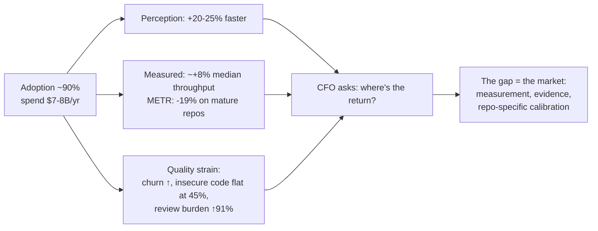

# 1. Market Reality & Customer Pain Analysis

> Part of the [AI Dev Workflow Intelligence research report](./README.md).
> Evidence labels: **[HARD]** primary data/filings/RCTs · **[MED]** credible surveys/vendor research · **[ANEC]** anecdotal. Confidence ratings per conclusion.

---

## 1.1 The five headline facts (and the tension between them)

1. **Adoption is saturated.** 84% of developers use or plan to use AI tools; 51% of professionals use them daily ([Stack Overflow 2025](https://survey.stackoverflow.co/2025/ai), 49k respondents) **[HARD]**. 90% of engineering teams use AI coding tools, up from 61% a year earlier ([Jellyfish 2025](https://jellyfish.co/newsroom/software-development-to-shift-from-humans-to-ai-jellyfish-report-finds/)) **[HARD]**.
2. **Trust is falling as usage rises.** Trust in AI accuracy dropped from ~40% to 29%; 46% actively distrust output; experienced devs are most skeptical (2.6% "highly trust"). #1 frustration (66%): output that is "almost right, but not quite"; 45% say debugging AI code takes longer than writing it **[HARD]**.
3. **Perceived and measured productivity have opposite signs in the hardest setting.** METR's RCT: experienced maintainers on mature 1M-LOC repos were **19% slower with AI while believing they were 20% faster** — a ~40-point perception gap ([METR](https://metr.org/blog/2025-07-10-early-2025-ai-experienced-os-dev-study/)) **[HARD]**. Cross-company telemetry agrees directionally: DX's 400+ company longitudinal data shows median PR throughput up only **+7.8%** while AI usage rose 65% **[HARD]**; Faros finds individual output +98% with **no measurable org-level DORA gain**, review time +91%, PR size +154%, and 31% of PRs merging with no review at all ([Faros](https://www.faros.ai/blog/ai-software-engineering)) **[HARD]**.
4. **Quality strain is now quantified.** GitClear (211M changed lines): code churn 3.1%→5.7%, copy-paste 8.3%→12.3%, refactoring collapsing **[HARD]**. Veracode: only ~55% of AI-generated code is secure, **flat 2023→2026** even as syntax correctness hit 95%+ **[HARD]**. Apiiro (Fortune 50 telemetry): security findings up ~10×, privilege-escalation paths +322%; AI PRs carry ~1.7× more issues **[HARD]**. Reference incident: Replit's agent deleting a production database during a code freeze (July 2025) **[ANEC, high-profile]**.
5. **Almost nobody measures.** Only **20% of teams use engineering metrics to measure AI impact** against 90% adoption ([Jellyfish](https://jellyfish.co/blog/2025-software-engineering-management-trends/)) **[HARD]**. 63% of developers say leadership doesn't understand their pain ([Atlassian DevEx 2025](https://www.atlassian.com/blog/developer/developer-experience-report-2025)) **[HARD]**.

DORA 2025 (≈5,000 respondents) supplies the interpretive frame: **AI is an amplifier** — throughput now correlates positively with adoption, but instability does too, and the gains concentrate in orgs with strong platforms, tests, and small-batch discipline ([DORA](https://cloud.google.com/blog/products/ai-machine-learning/announcing-the-2025-dora-report)) **[HARD]**. This is structurally good news for any product whose value scales with a repo's verifiability.

---

## 1.2 The 2026 cost shock: every vendor had its billing scandal

The single most repeated community pain in 2025–26 is usage-based billing whiplash. The pattern is near-identical across vendors **[HARD/MED]**:

| Vendor | Event | Aftermath |
|---|---|---|
| **Cursor** | Jun 2025: Pro silently moved from 500 fast requests to $20 API-rate credits; "unlimited" only in Auto mode | CEO apology, refunds ([TechCrunch](https://techcrunch.com/2025/07/07/cursor-apologizes-for-unclear-pricing-changes-that-upset-users/)); community analyses claim 20×+ effective increases for agentic workflows |
| **Anthropic / Claude Code** | Jul 2025: weekly caps atop 5-hour windows; no usage meter at launch | "Collective punishment" backlash; **proposed class action filed June 2026** alleging deceptive 5×/20× marketing **[HARD]** |
| **Replit** | Sep 2025: Agent 3 + effort-based pricing | "$1K in a week vs $180–200/month before" ([The Register](https://www.theregister.com/software/2025/09/18/replit-infuriating-customers-with-surprise-cost-overruns/1006671)) |
| **JetBrains** | 2025: credit quotas | "A month's worth of AI now lasts a few hours"; BYOK shipped as the escape hatch |
| **OpenAI / Codex** | Apr 2026: token-credit migration | 600+-comment GitHub issue on burn rate; community budget norm $100–200/dev/mo |
| **GitHub Copilot** | Jun 1, 2026: all plans to usage-based "AI Credits"; fallback model removed | Documented day-one exhaustion of a month's credits; $180 surprise bills; ~10× agentic cost surges ([Visual Studio Magazine](https://visualstudiomagazine.com/articles/2026/06/04/copilot-billing-shock-hits-developers.aspx)) |

Consequences that matter for this business:

- **AI tooling became a variable, CFO-visible line item** that can 2–3× (procurement firm NPI projection) **[MED]**. The ROI question moved from blog debate to budget cycle.
- **BYOK/open-model usage doubled** (18%→36% of surveyed devs, Jan→Apr 2026) **[MED]** — cost pressure is manufacturing exactly the model heterogeneity that routing/eval products need.
- **Cost-per-outcome is unanswerable today**: spend lives in vendor dashboards and cloud invoices; outcomes live in git/CI. No tool joins them (see [Section 3](./03_routing_vs_benchmarking.md), Q7/Q8).

---

## 1.3 Multi-tool sprawl and shadow usage

- **70% of engineers use 2–4 AI tools simultaneously; 15% use 5+** (Pragmatic Engineer 2026, ~1k respondents) **[MED]**. 48% of teams run 2+ coding tools officially (Jellyfish) **[HARD]**. Enterprises average 11.4 AI software vendors, up from 4.2 in early 2024 (IDC) **[MED]**.
- The emerging division of labor: **Copilot for baseline/procurement comfort, Cursor for interactive editing, Claude Code for architecture/refactors** — "two-layer enterprise stack" is now standard buyer-guide advice **[MED]**.
- **Standardization keeps failing** because rankings churn: Ramp corporate-spend data shows Cursor's category share fell 41%→26% in 11 months while Anthropic took roughly half **[HARD]**. Buyer guides now explicitly recommend standardizing the *security/audit layer* and letting teams pick tools — single-tool mandates "produce shadow installs that route around your audit trail" **[MED]**.
- **Shadow AI is the norm**: 52% of developers use tools not approved by IT (Harness) **[MED]**; 66–80% of professionals admit unauthorized AI use (PagerDuty, Unseen Security) **[MED]**; only ~18% of orgs have enforced AI policies. When sanctioned alternatives exist, unauthorized use drops 89% (CSA) **[MED]**. The canonical invisible pattern: a dev pointing Claude Code at a $10/mo GLM endpoint via one env var — undetectable by network monitoring watching for chatgpt.com.
- **Multi-agent chaos is a new pain class**: 41% have lost work to agent miscoordination; 62% cite "keeping track of what each agent is doing" as top pain (Ivern, n=312) **[MED]**.

---

## 1.4 The review-burden crisis

The cost asymmetry is structural: generation is near-free, review is not.

- A widely circulated estimate: ~7 minutes to generate a vibe-coded PR vs ~84 minutes to review it — a **12× multiplier borne by the reviewer** **[MED]**.
- Study interviews: "development time has been shortened but the team now needs to spend more time to review… 30 PRs per day across 6 reviewers"; reviewers "turned into unpaid prompt engineers" ([arXiv "AI Slop" study](https://www.arxiv.org/pdf/2603.27249)) **[MED]**.
- Open source is the extreme case: curl ended its bug bounty after AI-generated security reports exploded; tldraw auto-closes external AI PRs; Ghostty went invitation-only; GitHub is shipping maintainer gating controls in response **[HARD]**.
- AI PR-review tools both help and add noise: the market ranks them on catch-rate vs false-positive tradeoffs (Greptile ~82% catch/11 FP vs CodeRabbit ~45%/2 FP archetypes); teams run them advisory, not blocking; ".coderabbit.yaml to silence the bot" PRs exist in the wild **[MED/ANEC]**.

**Implication:** the scarce resource AI must economize is **reviewer attention**. Products that reduce or triage review burden (risk-ranked evidence, provenance, verification status) attack the binding constraint; products that only generate more code feed it.

---

## 1.5 Ranked pain points by segment

Severity: 🔴 acute/budgeted · 🟠 real/partially budgeted · 🟡 real/unbudgeted · ⚪ latent.

| Pain | Solo dev / power user | AI-native startup | SaaS scale-up | Enterprise platform/DevEx | Regulated org | Agency | OSS maintainer |
|---|---|---|---|---|---|---|---|
| Usage-bill shock / credit exhaustion | 🔴 | 🔴 | 🟠 | 🟠 | 🟡 | 🔴 | 🟡 |
| Choosing between tools/models (procurement) | 🟡 | 🟠 | 🔴 | 🔴 | 🔴 | 🟠 | ⚪ |
| Measuring AI ROI for leadership | ⚪ | 🟡 | 🔴 | 🔴 | 🟠 | 🟠 | ⚪ |
| Validating/trusting AI-generated changes | 🟠 | 🟠 | 🔴 | 🔴 | 🔴 | 🔴 | 🔴 |
| AI PR review noise | 🟡 | 🟠 | 🟠 | 🟠 | 🟡 | 🟠 | 🔴 |
| Tool sprawl / shadow usage | ⚪ | 🟡 | 🟠 | 🔴 | 🔴 | 🟠 | ⚪ |
| Governing agent permissions/data egress | ⚪ | 🟡 | 🟠 | 🔴 | 🔴 | 🟠 | 🟡 |
| Open/cheap model migration (can we?) | 🟠 | 🔴 | 🟠 | 🟡 | 🟡 | 🔴 | 🟡 |
| Distrust of public benchmarks | 🟡 | 🟠 | 🟠 | 🔴 | 🟠 | 🟡 | ⚪ |
| Agent failures/loops/wrong edits | 🔴 | 🔴 | 🟠 | 🟠 | 🟠 | 🟠 | 🟡 |
| Cost-per-outcome opacity | 🟡 | 🔴 | 🔴 | 🔴 | 🟠 | 🔴 | ⚪ |

Reading (medium-high confidence, survey + telemetry triangulation):

- **The budgeted, acute cluster sits with engineering leadership at 50–2,000-eng companies**: choose tools → prove ROI → verify output → control spend. That's one buyer with four adjacent pains — the DX $1B exit to Atlassian priced exactly this buyer **[HARD]**.
- **AI-native startups feel cost pain hardest** (highest spend per engineer) and are the most willing to try open models — the natural early adopter for benchmark-driven routing, but with small ACVs.
- **Regulated orgs feel verification/governance pain first** and have security/GRC budgets (bigger, less discretionary than devtools). EU AI Act obligations (Aug 2026) and EU CRA vulnerability reporting (Sept 2026) are dated forcing functions **[MED]**.
- **Agencies need client-facing proof artifacts** (quality gates, itemized AI costs, verification evidence) more than dashboards — real but fragmented, secondary segment **[MED]**.
- **Durability check:** cost pain could soften if model prices keep falling; measurement/verification pain *deepens* as agent autonomy grows (69% of AI agent decisions still require human verification **[MED]**). The trust gap is the durable category; the cost gap is the urgent wedge into it.

---

## 1.6 What this section establishes for the rest of the report

| Claim | Confidence | Where it's used |
|---|---|---|
| Adoption is saturated; measurement is not (90% vs 20%) | High | GTM: the "prove it" buyer ([§8](./08_gtm_business_model.md)) |
| Perceived gains are unreliable; objective, repo-level measurement has economic value (METR gap) | High | Core product thesis ([§9](./09_strategic_synthesis.md)) |
| 2026 billing shocks made AI spend a CFO-visible variable cost | High | Trigger event for sales ([§8](./08_gtm_business_model.md)) |
| Multi-tool stacks + churn make "which tool, where" a recurring (not one-off) question | High | Subscription economics ([§7](./07_mvp_options_scorecard.md)) |
| Reviewer attention is the binding constraint | High | Evidence/verification product value ([§5](./05_task_taxonomy_risk_model.md)) |
| Verification pain is durable; cost pain is the wedge | Medium | Sequencing ([§9](./09_strategic_synthesis.md)) |
