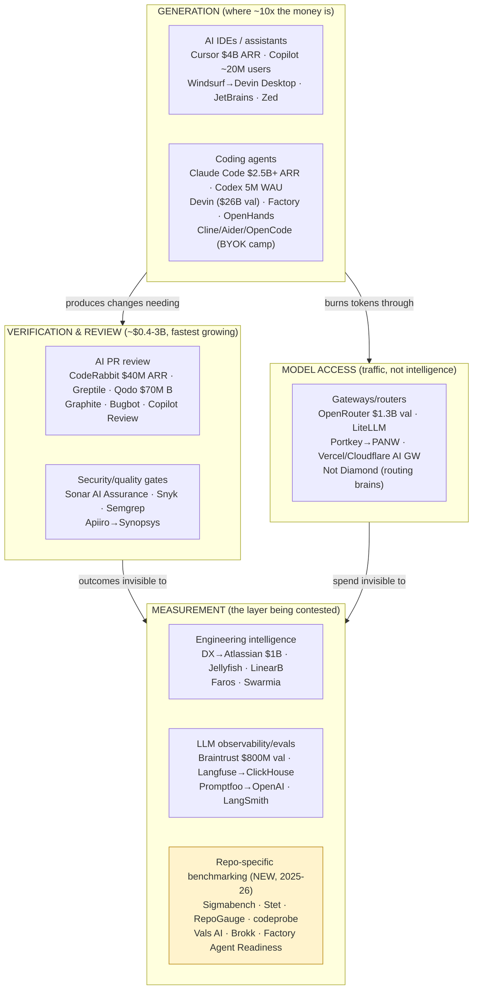
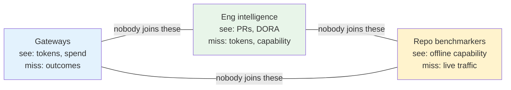

# 2. Competitive Landscape & White Space

> Part of the [AI Dev Workflow Intelligence research report](./README.md).
> Evidence labels: **[HARD]** / **[MED]** / **[ANEC]**. Full per-tool details and sources are in the research base; this section maps the field and identifies what is and isn't owned.

---

## 2.1 Category map

The structural fact from the buyer research: **spend on generation is ~10× spend on verification/measurement** ($7–8B market, Cursor alone $4B ARR, Claude Code $2.5B+ vs a ~$3–6B combined measurement/verification layer) **[MED/HARD]** — while every survey says teams can't measure or fully trust the output. That gap is the opportunity; it is also why every adjacent player is now crowding toward it.

## 2.2 Competitor matrix

Focused on players relevant to the evidence/benchmarking/routing/observability thesis (generation tools appear only where they bundle competing features). Threat = threat to the proposed wedge.

| Company | Category | Primary buyer | Repo-specific? | Private repos | Tool/model neutral? | Benchmarking | Routing | Observability | PR evidence | Procurement rec. | Pricing | Maturity | Threat | White space left |
|---|---|---|---|---|---|---|---|---|---|---|---|---|---|---|
| **Sigmabench** | Repo benchmarking | Eng leaders | ✅ core | ✅ (SaaS, read-only, SOC2) | ✅ agents+models | ✅ core | ❌ | ❌ | ❌ | Partial (leaderboard + paid eval) | Paid eval service | Early (launched Dec 2025) | **High** | Local-first; continuous mode; routing policies; outcome join |
| **Stet** | Repo eval (local) | Individual devs/teams | ✅ core | ✅ local-first | ✅ (Claude Code, Codex, Cursor) | ✅ core (incl. AGENTS.md A/B) | ❌ | ❌ | ❌ | Partial | Runs on your existing subscriptions | Very early | **High** (closest shape) | Team/enterprise layer; evidence packs; spend join |
| **RepoGauge / codeprobe / RepoAgentBench** | OSS repo benchmarking | Practitioners | ✅ | ✅ local | ✅ | ✅ | ❌ | ❌ | ❌ | ❌ | OSS | Early | Med (validates category, commoditizes basics) | Product layer above OSS |
| **Factory Agent Readiness** | Repo readiness scoring | Enterprise platform | ✅ (scores repo, not tools) | ✅ | ❌ (Factory's funnel) | Inverse (readiness) | ❌ | OTEL-native | ❌ | ❌ ("use Droids") | Bundled | Shipping | Med | Neutral cross-tool version of readiness |
| **Vals AI / LayerLens / HAL / Epoch** | Neutral eval infra | Labs, enterprises | Partial | Some | ✅ | ✅ (standardized harnesses) | ❌ | ❌ | ❌ | ❌ | Service/platform | Growing | Low-Med | Repo-mined, buyer-facing procurement reports |
| **OpenRouter** | Gateway | Devs→platform teams | ❌ | n/a | ✅ | ❌ | ✅ (per-prompt auto) | Spend only | ❌ | ❌ | 5% take | $1.3B val, 25T tok/wk | Med (owns traffic; no outcome data) | Outcome-aware routing; repo policy |
| **LiteLLM** | Gateway (self-host) | Platform teams | ❌ | n/a | ✅ | ❌ | Policy-based | Spend/budgets | ❌ | ❌ | OSS + $250/mo–$30k/yr | De facto standard | Low (natural **partner**: policy target) | Eval-driven config generation |
| **Not Diamond** | Routing intelligence | AI teams | ❌ (needs customer evals) | n/a | ✅ | ❌ (consumes evals) | ✅ core (+code router EA) | ❌ | ❌ | ❌ | API | $2.3M seed only | Med (partner or competitor for F) | The eval data itself; git/CI labels |
| **DX (Atlassian)** | Eng intelligence | VP Eng/CTO | ❌ (org metrics) | n/a | ✅ | ❌ | ❌ | ✅ AI measurement framework | ❌ | Partial (framework guidance) | ~$50–120k/yr class | $1B exit, 400+ cos | **High** (owns the buyer) | Task-level capability evidence; token-level join |
| **Jellyfish / LinearB / Faros / Swarmia** | Eng intelligence | VP Eng | ❌ | n/a | ✅ | ❌ | ❌ | ✅ AI usage↔delivery | ❌ | ❌ | $30/dev/mo–$120k/yr | Mature | Med-High | Same as DX |
| **CodeRabbit** | PR review | Eng teams | Context yes, evals no | ✅ | Reviews any PR | ❌ | ❌ | PR analytics | Partial (review comments ≠ evidence) | ❌ | $12–30/dev/mo | $40M ARR, 8k customers | Med (owns PR surface) | Audit-grade evidence packs; provenance |
| **Qodo** | Review + verification governance | Enterprise/compliance | Partial | ✅ (air-gap) | Partially | Own CodeReviewBench | ❌ | Partial | **Closest to "verification" positioning** | ❌ | $30/user/mo+ | $70M Series B | **High** for evidence wedge | Tool-neutral benchmarking + procurement |
| **Braintrust / LangSmith / Langfuse** | LLM evals/observability | AI app teams | ❌ (apps you build, not tools you buy) | n/a | ✅ | App evals | ❌ | ✅ traces | CI eval gates (different meaning) | ❌ | $249/mo+ | Braintrust $800M val | Low-Med | Entire "evaluate the tools you buy" domain |
| **Sonar / Snyk / Semgrep** | Code quality/security gates | AppSec | Rules yes | ✅ | ✅ | ❌ | ❌ | ❌ | Partial (compliance evidence: CRA/AI Act) | ❌ | Per-seat/scan | Mature, $100M+ ARR | Med (compliance framing overlap) | Agent/tool capability layer |
| **GitHub / Microsoft** | Platform | Everyone | Could be | ✅ | ❌ | ❌ | ❌ | Copilot metrics API | Natural owner of PR provenance | ❌ | Bundled | Dominant | **Existential long-term** | Neutrality (structurally can't be neutral) |

Sources: vendor sites/docs, funding announcements, and the five research workstreams; key figures: CodeRabbit ARR (Sacra) **[MED]**, DX acquisition (multiple) **[HARD]**, OpenRouter Series B (company blog/TechCrunch) **[HARD]**, Sigmabench/Stet/RepoGauge (vendor sites) **[HARD for existence/claims]**.

---

## 2.3 The consolidation wave (who buys whom)

2025–26 M&A shows measurement/eval assets being absorbed by platforms — evidence both that the layer is valuable and that standalone windows close fast **[HARD]**:

- DX → **Atlassian, $1B cash** (Sep 2025) — the measurement layer priced at strategic value
- Humanloop → Anthropic (acqui-hire, Aug 2025); Statsig → OpenAI ($1.1B, Sep 2025); Promptfoo → OpenAI (Mar 2026); Langfuse → ClickHouse (Jan 2026); Helicone → Mintlify (Mar 2026); Portkey → Palo Alto Networks (2026, per Portkey's own site); Galileo → Cisco (est. $400M–1B, May 2026); Apiiro → Synopsys (Jan 2026)
- Generation side: Windsurf three-way carve-up (Google $2.4B licensing + Cognition), Cursor → SpaceX $60B all-stock (pending), Cognition at $26B
- Neutral evaluation priced at a premium: **LMArena raised at $1.7B on ~$30M run-rate (~57×)** — the market pays for *trusted third-party measurement* **[MED]**

## 2.4 White-space analysis

What is genuinely owned already (avoid competing head-on):

- **PR review comments** (CodeRabbit/Bugbot/Copilot Review — saturated, price-compressed)
- **Gateway traffic** (OpenRouter/LiteLLM — infrastructure with network effects)
- **Org-level AI usage dashboards** (DX/Jellyfish/LinearB — own the VP Eng relationship)
- **App-eval tooling** (Braintrust et al. — different problem, same word)

What is contested but not owned (enter with differentiation):

- **Repo-specific tool/model benchmarking** — Sigmabench, Stet, RepoGauge, codeprobe all launched 2025–26; nobody has team/enterprise dominance, a continuous subscription motion, or the outcome join. Category validated, land-grab phase.
- **AI-code verification/evidence** — Qodo has the positioning, Sonar has the compliance framing, but audit-grade, tool-neutral evidence packs for agent-authored changes don't exist as a product yet.

What nobody owns (the actual white space, high confidence from the routing research):

> **The join between token-level spend and git/PR/CI outcomes.** Gateways see every token but no merges; engineering-intelligence platforms see merges but no tokens; benchmarking startups see offline capability but not live production. "Cost per verified merged change, by task type, by tool/model, on your repos" is computable by no shipping product as of July 2026 **[HARD absence-of-evidence, 15+ searches]**.

## 2.5 Incumbent expansion risk (who could kill the wedge)

| Incumbent | Likelihood of building repo-specific eval + evidence | Reasoning |
|---|---|---|
| GitHub/Microsoft | Medium, 12–24 mo | Natural owner of PR provenance metadata; but structurally non-neutral (will never rank Copilot below Claude Code) — neutrality is the startup's durable angle |
| Atlassian (DX) | **High**, 6–18 mo | Owns the buyer and the framework; lacks execution harness/eval DNA; likeliest acquirer or partner |
| Anthropic/OpenAI | Low for neutral evals | Conflict of interest is disqualifying; they acquire eval *talent* for internal use |
| Sigmabench/Stet | Already here | Race dynamics: differentiation must come from local-first + continuous + outcome join, not "benchmarks exist" |
| Qodo/Sonar | Medium | Compliance-evidence framing overlaps; their DNA is review/SAST, not cross-tool eval |
| OpenRouter/LiteLLM | Low as competitors | No repo/outcome access, no appetite shown; **highest-value partners** (policy consumers) |

**Bottom line (medium-high confidence):** the field is crowded at every adjacent layer but the specific composite — *local-first repo benchmarking + live outcome correlation + policy/evidence artifacts, tool-neutral* — is unclaimed. The window is real but short: 2025–26 category formation (Sigmabench, Stet) plus incumbent buyer ownership (DX/Atlassian) suggests 12–18 months before the land-grab resolves. See [Section 3](./03_routing_vs_benchmarking.md) for why the data join is the defensible core, and [Section 7](./07_mvp_options_scorecard.md) for the entry sequencing.
