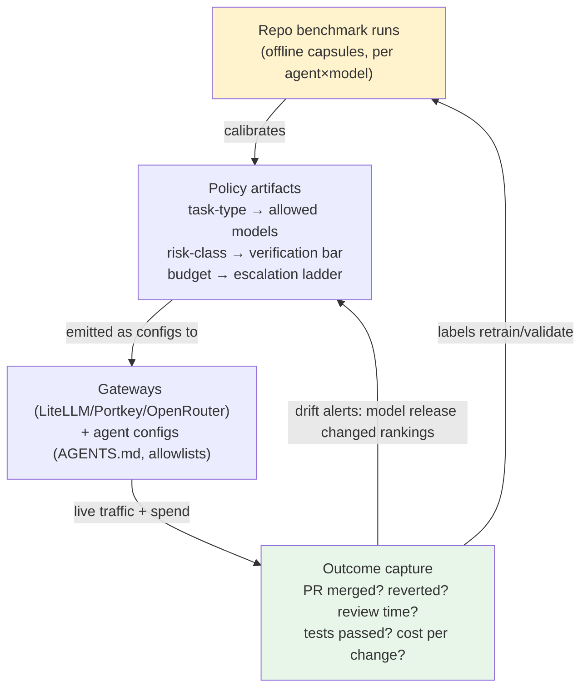

# 3. Routing vs. Benchmarking: Is Generic Routing Enough?

> Part of the [AI Dev Workflow Intelligence research report](./README.md).
> This section tests the key strategic objection: *"Generic model routing may be sufficient; teams may not need repo-specific benchmarking."*

---

## 3.1 Short answer

**No — but not for the reason the initial thesis assumed.** Generic routing isn't "insufficient benchmarking"; it's a different product operating on the wrong unit of analysis (the request, not the task), with the wrong feedback loop (static preference labels, not execution outcomes), at the wrong layer (mid-trajectory traffic it can't safely re-route). The evidence also cuts the other way: **routing intelligence has barely monetized** ($45M raised across all pure-routing startups vs $165M+ into OpenRouter's traffic business), so "become a better router" is a weak business even if technically right. The defensible asset is the **evaluation/outcome data routing would need** — which is also the asset procurement and verification need. Confidence: high on the technical analysis, medium-high on the commercial read.

## 3.2 What the routing/gateway market actually is (July 2026)

| Layer | Players | What they solve | What they don't |
|---|---|---|---|
| Traffic & governance | OpenRouter ($1.3B val, 25T tok/wk, ~$50M rev), LiteLLM (52k stars, $250/mo–$30k/yr enterprise), Portkey→PANW, Cloudflare/Vercel AI GW, Kong | Keys, budgets, fallbacks, load balancing, spend attribution, provider failover | Which model *should* handle this task; whether output was any good |
| Routing intelligence | Not Diamond ($2.3M seed; powers OpenRouter auto-router; code router in early access), Martian (quiet), RouteLLM (OSS/academic) | Per-prompt model classification against quality/cost/latency dials | Trajectory awareness; execution verification; repo specificity |
| Observability/evals | Braintrust, LangSmith, Langfuse→ClickHouse, HoneyHive | Tracing/evaling **AI apps you build** | Measuring **AI dev tools you buy**; git/PR/CI outcome joins |

Three hard facts anchor the analysis **[HARD]**:

1. **Coding became the gateway killer workload**: programming went from ~11% of OpenRouter usage in early 2025 to **>50% by mid-2026**; agentic workflows generate over half of output tokens; top coding tools route >1.4T tokens/day through it ([OpenRouter State of AI](https://openrouter.ai/state-of-ai)).
2. **All shipped commercial routing is per-prompt classification.** OpenRouter's auto-router (Not Diamond-powered) even implements *session stickiness* — deliberately pinning one model per conversation to preserve prompt caches, i.e., the largest router in production actively avoids mid-trajectory re-routing.
3. **Gateways court coding agents for governance, not intelligence**: Vercel AI Gateway markets "route Claude Code/Codex/Cline/OpenCode through us" for spend visibility; Kong and LiteLLM publish Claude Code governance guides (per-dev quotas, cost attribution). The pitch is control, never "we'll pick better models for your repo."

## 3.3 The five questions, answered

**Q1. Can routers learn enough from live traces, without upfront benchmarks?**
Not today. Commercial custom routers require labeled eval data upfront (Not Diamond: (input, response, score) triples, min 15/practically thousands of samples; RouteLLM: pairwise preference labels). No commercial router does online learning from production traces. The 2026 research frontier (Agent-as-a-Router/ACRouter, TwinRouterBench) shows it's *possible* — specifically because **coding emits free, objective labels** (tests pass, patch applies, CI green, PR merges, revert happens). But nobody ships it **[HARD]**.

**Q2. Are prompt-level router metrics sufficient for coding tasks?**
No, structurally. TwinRouterBench's authors state the diagnosis: existing benchmarks "evaluate routers only on one-shot prompts… never expose the router-visible prefix at an intermediate agent step, never test whether a cheaper replacement preserves downstream task success." A cheap model at step 12 can silently poison step 40; per-response quality metrics can't see that. Coding requires **trajectory-level, execution-verified feedback** — which is benchmark-shaped data **[HARD, peer-reviewed]**.

**Q3. Can routing alone optimize for accepted PRs, review burden, security risk, human time?**
No — those signals live in git/CI/review systems that no router or gateway ingests. This is the market's clearest structural gap (established across 15+ searches): **gateways have the traffic, engineering-intelligence platforms have the outcomes, academia has the methods, and nobody has all three.** DX computes "net AI dollar impact" from licenses and PR telemetry but sits outside the token path; OpenRouter sits inside the token path but sees no merges **[HARD absence-of-evidence]**.

**Q4. Is repo-specific benchmarking a separate product, or just a feature of a router?**
Separate product, three reasons. (a) *Different buyer moment*: benchmarking sells at procurement/renewal/model-release time to eng leadership; routing sells continuously to platform teams. (b) *Different trust posture*: benchmarking requires repo access (local-first solves it); routing requires traffic interception. (c) *Routing is the smaller prize commercially*: subscription-based tools (Copilot, Claude Max, Cursor) mostly bypass gateways entirely, so route-optimizable spend is a minority of coding spend today. The right architecture is benchmarking that **emits routing policy as an artifact** (LiteLLM configs, model allowlists, escalation ladders) rather than a router that needs benchmarks **[MED, inference]**.

**Q5. Could Not Diamond / OpenRouter / LiteLLM naturally own this space? Compete or integrate?**
**Integrate.** OpenRouter monetizes volume, not intelligence; it outsourced its routing brain to Not Diamond. LiteLLM is config-driven — a policy generator is upstream of it, not competitive with it. Not Diamond is the only overlap risk (its code router consumes exactly the eval data this business would generate), but it's thinly capitalized ($2.3M) and needs customers to *bring* eval data — a benchmark product is its ideal supplier or acquirer target, not its victim. The consolidation wave (Portkey→PANW, Helicone→Mintlify, Humanloop→Anthropic, Promptfoo→OpenAI) confirms that standalone plumbing exits; data/eval depth survives **[MED-HIGH]**.

## 3.4 Where routing DOES win (be fair to the objection)

- **Read-vs-write substep routing is real and productized**: OpenRouter shipped `openrouter:subagent` (frontier orchestrator delegates summarization/extraction/boilerplate to cheap workers); planner/executor splits show ~57% cost cuts per build; vendor-measured savings 40–85% **[MED]**. For the *volume* economics of agent workflows, generic mechanisms capture much of the easy money without any repo-specific data.
- **Failover/price arbitrage/provider selection** needs no benchmarks at all.
- If a team's only question is "cut our token bill 40% without much quality risk," a gateway plus subagent delegation may genuinely be enough. Repo-specific evidence earns its keep on the harder questions: *which tool/agent to standardize on, which tasks to trust to which tier, what to allow in regulated paths, and whether last month's model release changed the answers.*

## 3.5 The synthesis: benchmark → policy → outcome loop

The winning shape is not "router" or "benchmark" but the closed loop both need:

Whoever closes this loop owns both the procurement question and the routing question. The benchmark side is buildable first (no traffic interception needed, sells episodically at high intent); the outcome side converts it into a subscription; the policy side monetizes it through partners rather than against them. This sequencing is scored in [Section 7](./07_mvp_options_scorecard.md).

**Falsifiable claim to monitor:** if OpenRouter or Not Diamond ships execution-verified, trajectory-level coding routing trained on customer traces within 12 months, the routing-policy expansion (Phase 3 in [§6.4](./06_technical_architectures.md)) loses value and the business must lean fully on procurement evidence + verification. The benchmark/evidence core survives that scenario; a routing-first strategy would not — which is itself the strongest argument for the evidence-first sequencing.
