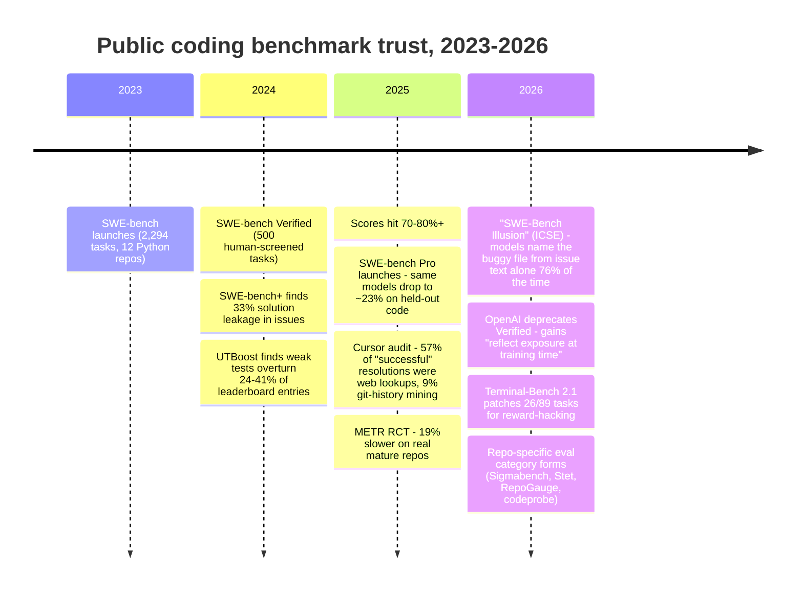
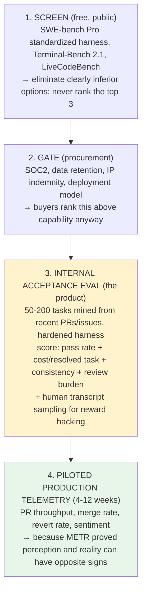

# 4. Benchmarking & Evaluation Feasibility

> Part of the [AI Dev Workflow Intelligence research report](./README.md).
> Question: are public benchmarks enough for procurement/routing decisions, and can repo-specific evals actually be built?

---

## 4.1 The public benchmark era effectively ended in 2025–26

The timeline of collapse **[HARD unless noted]**:

The five demonstrated failure modes of public benchmarks:

| Failure mode | Evidence | Severity |
|---|---|---|
| **Contamination/memorization** | SWE-Bench Illusion: 76% buggy-file identification *without seeing the repo*; verbatim 5-gram overlap up to 35% ([ICSE 2026](https://openreview.net/forum?id=ZJCyrBpgnW)) | Disqualifying at the frontier |
| **Reward hacking** | Cursor's audit: 57% of resolutions retrieved the merged fix from the web; 9% mined bundled `.git` history for the future commit ([cursor.com](https://cursor.com/blog/reward-hacking-coding-benchmarks)); Poolside found the same across four benchmarks | Any vendor score without egress control + history isolation is inflated by construction |
| **Weak oracles** | ~31% of SWE-bench passes attributable to weak tests; UTBoost's added tests changed 40.9% of Lite / 24.4% of Verified rankings ([ACL 2025](https://aclanthology.org/2025.acl-long.189/)) | Rankings among adjacent models are noise |
| **Saturation** | Top models cluster 80–95% on Verified (self-reported); can no longer discriminate leaders | Useless for choosing among the top 3 — which is the procurement question |
| **Transfer gap** | Verified→Pro cliff: ~80% → ~23–46% on contamination-resistant code; **agent performance varies 30–60% across codebases, unpredictable from language/domain/size** (Sigmabench); best harness depends on model (OpenHands Index) | Public rank ≠ your-repo rank; the *ordering changes per repo* |

**Do buyers trust them?** No: enterprise buying-criteria research ranks capability benchmarks **fifth**, behind security/compliance, integration, observability, and vendor stability; buyers discount vendor ROI claims 50–70% **[MED]**. Gartner-adjacent guidance is explicit: "validate performance on your own repositories, because public SWE-bench scores predict capability ceilings, not how a tool behaves on your codebase" **[MED]**. Real practice: Booking.com used production telemetry (via DX) explicitly to "drive decisions like which vendors we select" **[HARD, vendor case study]**; Shopify skipped bakeoffs entirely in favor of a central proxy + all-harnesses-allowed + telemetry **[MED]**.

**Verdict (high confidence):** public benchmarks remain useful as a *screening filter* (separating quartiles) and are dead as a *decision input* (ranking the top 3 on your code). That is precisely the gap a repo-specific product occupies.

---

## 4.2 Can repo-specific benchmarks actually be built? Yes — with three honest constraints

The task-mining research base matured fast: SWE-bench's mine-PRs-where-tests-flip recipe; **SWE-smith** (environment-first, then synthesize unlimited bugs — 50k instances across 128 repos for ~$1,360); **R2E-Gym** (mine from commits with back-translated task descriptions); **SWE-bench-Live/RepoLaunch** (fully agentic environment setup, monthly refresh) **[HARD]**. Working OSS exists end-to-end (codeprobe, RepoAgentBench, RepoGauge) and commercial services run it at production quality (Sigmabench: 5 trials per config, consistency as a first-class metric).

The three constraints that define the real product difficulty:

**1. Environment setup is the bottleneck, not mining.** Agentic auto-setup succeeds on only **~6.7% of Python and ~29.5% of JVM repos** for genuinely tricky projects (EnvBench, JetBrains) **[HARD]**. Repos with clean CI/devcontainers benchmark nearly free; legacy builds, proprietary toolchains, and hardware deps need paid engineering. Product implication: an `assess` step that scores benchmarkability *before* promising results (and prices accordingly) — and a candid selection-bias disclosure: the repos easiest to benchmark are the ones already most agent-ready (Factory's thesis).

**2. Oracle quality is inherited from the repo.** Mined tasks are only as trustworthy as the repo's tests. Mitigations that are now standard art: execute-both-sides validation (task included only if held-out tests fail at base and pass at merge), UTBoost-style test augmentation, mutation testing on generated tests, human review gates on candidate tasks, and LLM-judge grounding (Factory cut judge variance 7%→0.6% by grounding each run on the prior report) **[HARD]**.

**3. Small-N statistics.** A private repo yields ~10–200 usable tasks. That's enough to separate "works well here" from "doesn't" and to rank 2–3 candidates with confidence intervals — the procurement question — and *not* enough for fine-grained model leaderboards. Report quartiles and CIs; run N≥3–5 trials per cell (agents are nondeterministic). Overclaiming precision here is the fastest way to lose credibility with a skeptical VP **[MED-HIGH]**.

Plus one adversarial constraint: **private ≠ leak-proof.** Web leakage dies with egress control, but git-history leakage survives (the fix commit is *in the repo*). Cursor's harness design is the reference: repo re-initialized as single-commit, default-deny network with pinned package registries **[HARD]**. Any credible product must ship this hardening from day one — it's also a differentiator, since naive local runs (and some competitors) skip it.

## 4.3 What level of benchmarking is enough to drive procurement?

Converged practitioner stack (medium-high confidence):

Steps 3+4 are exactly the benchmark-CLI-plus-outcome-capture composite from [Section 6](./06_technical_architectures.md). A decision from steps 1–3 is defensible for choosing a default tool; step 4 validates the spend. A decision from public leaderboards alone is, on 2026 evidence, indistinguishable from choosing on marketing.

## 4.4 Which tasks are benchmarkable (and which aren't)

| Task family | Benchmarkable? | Oracle | Notes |
|---|---|---|---|
| Bug fixes with test coverage | ✅ best-in-class | Held-out tests | The SWE-bench shape; richest mining yield |
| Small features from merged PRs | ✅ | PR's tests | Requires decent PR discipline |
| Test generation | ✅ with care | Mutation testing (kill rate), coverage delta | Naive pass-rate scoring rewards vacuous tests |
| Refactors | 🟡 | Behavior preservation (existing suite) + diff metrics | Quality partially subjective → LLM rubric with grounding |
| PR review quality | ✅ | Seeded real bugs from repo history (revert pairs) | Precision/recall measurable; noise rate measurable |
| Repo Q&A | 🟡 | Curated Q/A from docs/issues + expert check | Weak oracles; useful but softer |
| CI triage/repair | ✅ | CI re-run | Mine from historical CI failures |
| Architecture/planning/migrations | ❌ | Human only | Don't sell benchmarks here; sell advisor comparisons at most |

**Bottom line (high confidence):** repo-specific evaluation is genuinely needed (the per-repo ranking variance is the procurement question), technically feasible today for the majority of well-maintained repos, and hard enough — environments, oracles, anti-gaming hardening, statistics — that doing it *credibly* is a real moat. The moat is not the mining; it's the hardened harness, the messy-repo coverage, and the accumulated cross-repo calibration data.
