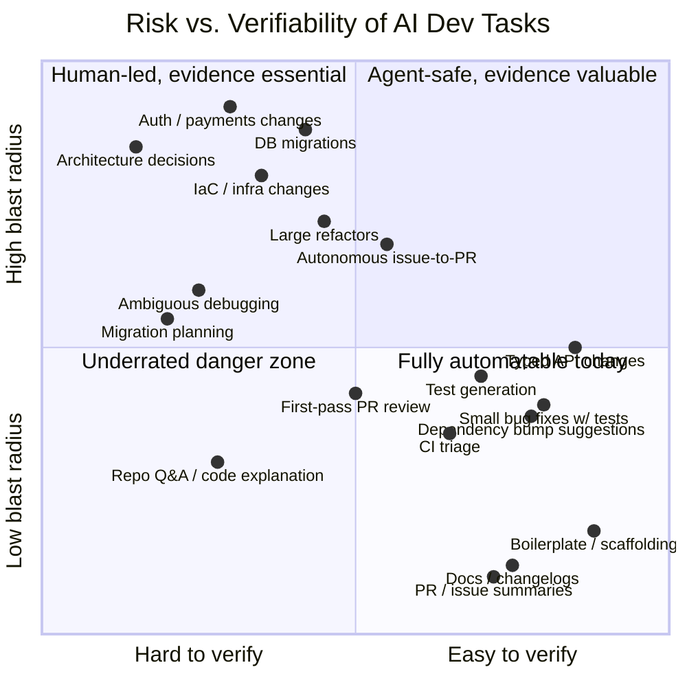
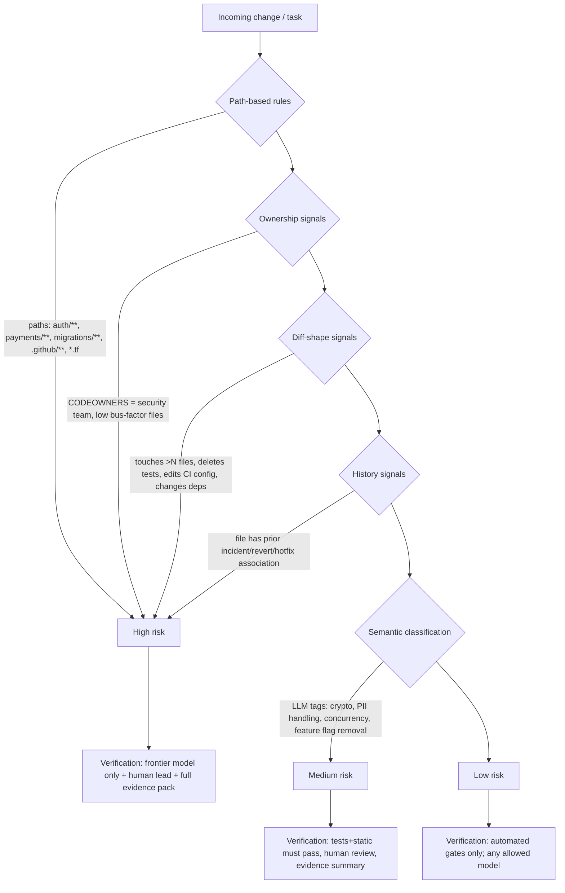

# 5. Task Taxonomy & Risk Model for AI Development Workflows

> Part of the [AI Dev Workflow Intelligence research report](./README.md).
> This section is primarily **analytical** (inference from evidence in sections 1–4), not direct survey data. Confidence labels are given per row.

---

## 5.1 Why a task taxonomy matters

Every downstream product decision in this research — routing, benchmarking, verification, procurement — depends on one underlying fact: **AI task risk and AI task verifiability are not the same axis.**

- Some tasks are low-risk *and* easily verified (docs, PR summaries) → cheap models fine, no evidence needed.
- Some tasks are high-risk *and* easily verified (typed API change with strong test suite) → agents fine, evidence valuable.
- Some tasks are low-risk but *hard* to verify (repo Q&A — a wrong answer silently misleads) → underrated danger zone.
- Some tasks are high-risk *and* hard to verify (auth changes, migrations, architecture) → frontier models + humans, evidence essential.

The key structural insight: **verifiability is a property of the repo, not the model.** A repo with a fast, trustworthy test suite converts "high-risk" tasks into "high-risk but checkable" tasks. This is why Factory's Agent Readiness product scores repos, not models, and why DORA 2025 found AI amplifies existing engineering quality rather than substituting for it (see [Section 1](./01_market_reality_and_pain.md)). It is also the strongest argument that *repo-specific* evaluation carries signal that public benchmarks cannot.

---

## 5.2 Full task taxonomy

Legend for "verification method": **T** = automated tests, **S** = static analysis/types, **H** = human review, **O** = outcome observation (prod monitoring), **D** = diff inspection.

### Low-risk tier

| Task | Current AI usage | Verification | Cheap/open models viable? | Frontier needed? | Routing win | Evidence pack value | Confidence |
|---|---|---|---|---|---|---|---|
| Repo Q&A / code explanation | Very high (top use case in Stack Overflow 2025 & JetBrains surveys) | H (spot-check); weak oracles | **Yes** — but wrong answers are silent; retrieval quality matters more than model | No | High (cost) | Low | High |
| Docs / changelogs | High | H, D | **Yes** | No | High | Low | High |
| PR summaries / issue summaries | High (CodeRabbit, Copilot, Graphite all ship this) | H (skim) | **Yes** | No | High | Low | High |
| File discovery / navigation | High (embedded in every agent) | Self-evident | **Yes** | No | Medium | None | High |
| Boilerplate / scaffolding | Very high | T, S, D | **Yes** | No | High | Low | High |
| Simple test ideas (not code) | Medium | H | **Yes** | No | Medium | Low | Medium |

### Medium-risk tier

| Task | Current AI usage | Verification | Cheap/open models viable? | Frontier needed? | Routing win | Evidence pack value | Confidence |
|---|---|---|---|---|---|---|---|
| Test generation | High and rising (Qodo's wedge; Copilot/Cursor common use) | T runs + **mutation testing** needed to catch vacuous tests | Partially — open models produce plausible-but-weak asserts more often | Preferred for complex units | Medium | **High** (test quality is a classic weak oracle) | Medium |
| Small bug fixes | High (the SWE-bench task shape) | T, S, D | Sometimes — Qwen3-Coder / GLM / Kimi close on easy bugs; fail on cross-file | For cross-file/ambiguous | **High** — this is the volume workload | High | High |
| CI triage / flaky test diagnosis | Growing (CI-repair agents) | T re-run, H | Yes for classification; no for fixes | For root-causing | High | Medium | Medium |
| Dependency update suggestions | Medium (Renovate/Dependabot + AI explainers) | T, S | Yes | No | Medium | Medium | Medium |
| Small refactors | High | T, S, D | Sometimes; edit-format reliability is the bottleneck (Aider leaderboard evidence, [Section 4](./04_benchmarking_feasibility.md)) | For behavior-preserving guarantees | Medium | Medium | High |
| First-pass PR review | High (CodeRabbit ~entire business; Bugbot, Copilot Review) | H (meta-review); precision/recall measurable on seeded bugs | Partially — noise rate is the failure mode, and noise is a *product* problem, not just a model problem | For low-noise review | Medium | **High** (review noise is a top complaint, see [Section 1](./01_market_reality_and_pain.md)) | High |
| Typed API changes | High | S (strong oracle), T | **Yes** when types are strict — type systems are free verifiers | No | High | Low | Medium |
| Internal tools / scripts | Very high | H, O | Yes | No | High | Low | High |
| Migration planning (plan only) | Medium | H | No — planning quality gap is large | **Yes** | Low | Medium | Medium |

### High-risk tier

| Task | Current AI usage | Verification | Cheap/open models viable? | Frontier needed? | Routing win | Evidence pack value | Confidence |
|---|---|---|---|---|---|---|---|
| Auth / authz changes | Deliberately low; often policy-excluded | T + security review (H) + SAST | **No** | Yes, with human lead | Low (should not route down) | **Very high** | High |
| Payments | Same as auth | T, H, O (canary) | **No** | Yes, human lead | Low | **Very high** | High |
| Infra / IaC | Low-medium; high fear (Stack Overflow: deployment = most-resisted AI task, 76% won't) | Plan/preview diffs (terraform plan = decent oracle), H | No | Yes | Low | High | High |
| Security review | Growing (Snyk/Semgrep/CodeQL AI + agents) | Seeded-vuln benchmarks possible | Partially (pattern-matching yes, novel logic no) | Yes | Low | High | Medium |
| DB migrations | Low-medium | Staging replay, H | No | Yes | Low | **Very high** | High |
| Ambiguous debugging | Medium (devs try AI first, escalate) | Repro test (when it exists = strong oracle) | No — long-horizon reasoning gap | Yes | Medium (escalation routing) | Medium | Medium |
| Architecture decisions | Medium as advisor | H only; essentially unbenchmarkable | No | Yes (as advisor) | Low | Low | High |
| Large refactors | Growing (Claude Code / Codex long-horizon) | T + S + D + H | No | Yes | Low | High | Medium |
| Autonomous issue-to-PR | Early but real (Copilot coding agent, Devin, Codex cloud) | Full gate: T+S+H+evidence | No | Yes | Medium (task-selection routing: *which issues* to hand to agents) | **Very high** | High |
| Final review before merge | Human-owned; AI assists | H (non-delegable in most orgs) | n/a | n/a | n/a | **Very high** (this is where evidence lands) | High |
| Regulated / compliance-sensitive code | Very low official usage | H + audit trail | No | Yes | Low | **Very high** (audit demand, EU AI Act Aug 2026) | Medium |

---

## 5.3 The heatmap: task type × tool/model category

Cell values: ✅ safe · 🟡 maybe (verify) · ❌ unsafe · ❓ unknown/insufficient evidence.

| Task ↓ / Setup → | Frontier in premium agent (Claude Code, Codex) | Frontier in IDE assistant (Cursor, Copilot) | Hosted open model via gateway (Qwen/GLM/Kimi via OpenRouter etc.) | Local model (Ollama, ~7–70B) | Self-hosted big open model (vLLM cluster) | PR-review specialist (CodeRabbit, Bugbot…) | Generic chat (ChatGPT/Claude web) | Multi-agent worktree bakeoff |
|---|---|---|---|---|---|---|---|---|
| Repo Q&A | ✅ | ✅ | ✅ | 🟡 (retrieval-limited) | ✅ | n/a | 🟡 (no repo ctx) | overkill |
| Docs / changelogs | ✅ | ✅ | ✅ | ✅ | ✅ | n/a | ✅ | overkill |
| PR / issue summaries | ✅ | ✅ | ✅ | ✅ | ✅ | ✅ | ✅ | overkill |
| Boilerplate | ✅ | ✅ | ✅ | 🟡 | ✅ | n/a | ✅ | overkill |
| Test generation | ✅ | ✅ | 🟡 (vacuous-test risk ↑) | ❌ | 🟡 | n/a | 🟡 | 🟡 useful |
| Small bug fixes | ✅ | ✅ | 🟡 (repo-dependent — the 30–60% Sigmabench variance lives here) | ❌ | 🟡 | n/a | ❌ (no execution) | ✅ useful |
| CI triage | ✅ | 🟡 | 🟡 | ❌ | 🟡 | n/a | ❌ | 🟡 |
| Small refactors | ✅ | ✅ | 🟡 (edit-format reliability) | ❌ | 🟡 | n/a | ❌ | ✅ useful |
| First-pass PR review | ✅ | 🟡 | 🟡 | ❌ | 🟡 | ✅ (their job) | 🟡 | n/a |
| Typed API changes | ✅ | ✅ | ✅ (types = free oracle) | 🟡 | ✅ | n/a | ❌ | 🟡 |
| Auth / payments | 🟡 human-led | 🟡 human-led | ❌ | ❌ | ❌ (still needs human lead) | 🟡 (as extra reviewer) | ❌ | 🟡 (as advisor variants) |
| Infra / IaC | 🟡 | 🟡 | ❌ | ❌ | ❌ | 🟡 | ❌ | ❌ |
| Security review | 🟡 (assist) | 🟡 | ❌ | ❌ | 🟡 | 🟡 | ❌ | 🟡 |
| Migrations | 🟡 | 🟡 | ❌ | ❌ | ❌ | 🟡 | ❌ | ❌ |
| Ambiguous debugging | ✅ (best available) | 🟡 | ❌ | ❌ | ❓ | n/a | 🟡 (rubber duck) | ✅ (2 approaches beats re-prompt) |
| Architecture decisions | 🟡 advisor only | 🟡 | ❌ | ❌ | ❌ | n/a | 🟡 advisor | 🟡 (compare proposals) |
| Autonomous issue-to-PR | 🟡 (repo-dependent; gate on readiness) | ❌ (wrong tool shape) | ❓ (early: Kimi K2 + OpenCode shows promise) | ❌ | ❓ | n/a | ❌ | ✅ (bakeoff = quality hedge) |
| Regulated code | 🟡 with audit trail | 🟡 | ❌ | ❌ | 🟡 (data-residency argument FOR self-host) | 🟡 | ❌ | ❌ |

**Reading the heatmap — three commercial observations:**

1. **The 🟡 column is the product.** Wherever the answer is "maybe, depends on the repo," a generic recommendation is impossible and a repo-specific answer has value. The 🟡 cells cluster in exactly the medium-risk tier that carries most engineering volume (bug fixes, refactors, test gen, review).
2. **The open-model column is almost entirely 🟡/❌ for *agentic* tasks but ✅ for *read-only* tasks.** The cheapest credible routing win is not "route easy edits to Qwen" — it's "route the enormous read-only token volume (Q&A, summarization, retrieval, triage) away from frontier prices." Agent traces show read/search operations dominate token counts. This is lower risk than routing edits and much easier to verify.
3. **The evidence-pack value column correlates with risk, not with volume.** Verification/evidence products monetize the high-risk minority of changes; observability and routing monetize the high-volume majority. A product that needs both engines to work is doing two startups at once — this feeds the MVP scoring in [Section 7](./07_mvp_options_scorecard.md).

---

## 5.4 Risk classification: how to do it mechanically

For routing policies, PR evidence, or benchmark task selection, risk must be classified automatically. Practical signal stack (all implementable from git + repo metadata alone):

- **Path rules** get ~70% of the value for ~5% of the effort (medium confidence, inference from how CODEOWNERS and branch-protection are actually used).
- **History signals** (reverts, hotfixes, incident-linked files) are the underexploited one — they're minable from git alone and are repo-specific by construction.
- **Semantic classification** is the only layer needing an LLM, and it's a cheap-model task (classification, not generation) — pleasingly, the risk classifier itself is routable to a cheap model.

---

## 5.5 What this taxonomy implies for each candidate product

| Product direction | What the taxonomy says |
|---|---|
| Repo-specific benchmarking | Focus tasks on the 🟡 band (bug fixes, refactors, test gen) — that's where repo-variance is decisive and oracles (tests/types) exist. Don't bother benchmarking ✅ tasks (any model works) or ❌ tasks (no one should automate them yet). |
| Routing | The safe, immediate win is **read-vs-write routing** (cheap models for read-only substeps) and **task-selection routing** (which issues are agent-safe), not fine-grained model arbitrage on edits. |
| PR evidence | Value concentrates in high-risk changes and in *autonomous-agent* PRs. Evidence for a human-driven one-line docs PR is noise. Risk-classify first, generate evidence proportionally. |
| Observability | Must join task type to outcome; raw token/spend dashboards miss the point. "Cost per merged medium-risk change" is the unit that maps to this taxonomy. |
| Procurement | A recommendation is only credible if segmented by task tier — "use X" is vendor-speak; "use X for tier-2 bug fixes on repos with test coverage >Y, keep humans on tier-3" is an actionable policy. |

**Overall confidence:** the tier structure and verification mapping are high confidence (grounded in survey resistance data, benchmark design literature, and tool positioning). Individual cell judgments for open/local models are medium confidence and moving fast — they are exactly what a repo-specific eval product would keep current. See [Section 4](./04_benchmarking_feasibility.md) for the evidence on benchmark oracles and [Section 6](./06_technical_architectures.md) for how the risk classifier is built.
