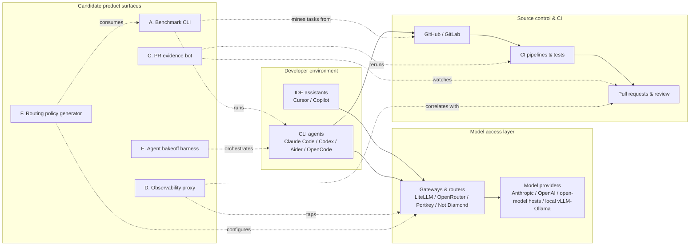
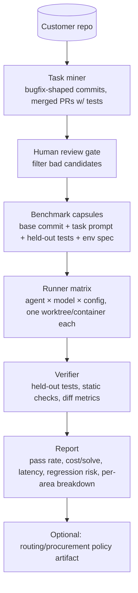
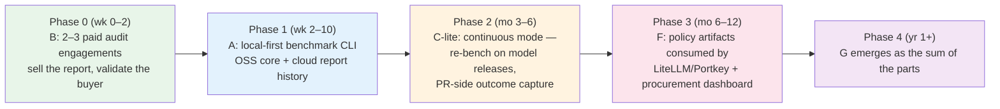

# 6. Technical Architecture Options

> Part of the [AI Dev Workflow Intelligence research report](./README.md).
> This section evaluates seven buildable architectures (A–G), answers the practical build questions from the research brief, and feeds the MVP scorecard in [Section 7](./07_mvp_options_scorecard.md).

---

## 6.1 The system landscape — where each architecture sits



Key placement insight: **A, C, E sit on the git/CI side (outcome data lives here); D and F sit on the gateway side (spend data lives here).** The initial business thesis — an evidence/calibration layer — requires joining both sides. No incumbent currently owns that join: gateways see tokens but not merges; SCM platforms see merges but not tokens; engineering-intelligence platforms (DX, Jellyfish) see both only at coarse, self-reported granularity (see [Section 2](./02_competitive_landscape.md)).

---

## 6.2 Architecture evaluations

Scoring: 1 (bad) – 5 (excellent). "TTM" = time to credible MVP for a strong solo technical founder.

### A. Repo benchmark CLI (local-first)

Mines tasks from git history → builds benchmark capsules → runs agents in isolated worktrees/containers → runs tests → reports quality/cost/latency.



| Dimension | Score | Notes |
|---|---|---|
| Technical difficulty | 3/5 | Task mining is the hard 20% (weak oracles, env setup). Runner+verifier is known art (SWE-bench harness, codeprobe/RepoAgentBench/Stet prove a solo dev can build it). |
| Time to MVP | **4–8 weeks** | Narrow scope: Python/TS repos, pytest/vitest, 3 agent adapters (Claude Code, Codex CLI, Aider/OpenCode). |
| Dependency on closed tools | Medium | CLI agents are automatable (headless modes exist: `claude -p`, `codex exec`); GUI-only tools (Cursor IDE proper) are not — see 6.3. |
| Repo access burden | **Low** — local-first, code never leaves. This is the single biggest trust advantage over SaaS competitors (Sigmabench requires repo access to their service). |
| Outcome measurability | High — tests are the oracle |
| Defensibility | Low as OSS artifact, medium as data: accumulated cross-repo calibration ("repos like yours") is the moat, and it requires opt-in telemetry. |
| Buyer urgency | Medium — real (Sigmabench, Stet, RepoGauge all launched into this demand) but episodic: procurement moments, model releases. |
| Pricing potential | Low standalone (episodic use) → must convert to subscription via continuous re-benchmarking on model releases. |
| Competitive risk | **High and rising**: at least 4 direct entrants as of mid-2026 (Sigmabench, Stet, RepoGauge, codeprobe OSS). Category is validated but no longer empty. |

### B. Service-assisted procurement audit

Humans + the Architecture-A software; customer grants limited access; deliverable is a report and a recommended policy.

| Dimension | Assessment |
|---|---|
| Difficulty / TTM | Lowest of all — can sell before software exists; software accretes from repeat engagements |
| Measurability | High (same harness) |
| Defensibility | None in the service itself; the accumulating playbook + benchmark data is the asset |
| Pricing | $15–50k per audit is plausible against a $100k+/yr tool-spend decision (inference from tool spend data in [Section 8](./08_gtm_business_model.md)); repeatable quarterly as models change |
| Risk | Consulting gravity — margin and scaling ceiling; "feature-not-company" if it never productizes |
| Strategic value | **Highest learning-per-week of any option.** Every audit = paid customer discovery + benchmark data + a design partner for the SaaS. |

### C. GitHub App / PR evidence bot

Watches AI-authored PRs → captures provenance where available → reruns tests/static analysis → produces a risk-scored evidence pack on the PR.

| Dimension | Assessment |
|---|---|
| Difficulty | Medium. The blocker is **provenance**: most tools don't label their commits (Copilot coding agent and Devin do via co-author trailers; Cursor/Claude Code local commits generally don't). Detection heuristics are probabilistic and gameable. |
| TTM | 6–10 weeks for a useful v1 (evidence pack without perfect provenance: risk classification + verification status + agent-session summary if user opts in) |
| Dependency | High on GitHub API surface; moderate on agent vendors exposing session logs (Claude Code transcripts, Codex session files are locally readable — an installable collector can get real provenance) |
| Competitive risk | **Very high**: CodeRabbit/Bugbot/Copilot Review own the PR-comment surface; GitHub itself is the natural owner of "AI-authored PR metadata". Differentiation must be *evidence & audit*, not *review comments* — a compliance artifact, not a linter. |
| Pricing | Per-PR or per-seat; compliance framing (EU AI Act, SOC2 auditors asking about AI code) unlocks security budget, which is larger and stickier than tooling budget. |
| Timing | Early. Strongest in regulated verticals; weak in startups (they don't care yet). |

### D. AI workflow observability proxy

Integrates at the gateway (LiteLLM/OpenRouter/Portkey callbacks, or as OTel collector) + git/PR/CI webhooks → correlates spend with outcomes → "cost per accepted change" dashboards.

| Dimension | Assessment |
|---|---|
| Difficulty | The telemetry plumbing is easy; **attribution is the hard part.** Joining a Cursor session to the eventual merged PR requires either (a) all traffic through a gateway you see + commit-session correlation, or (b) local collectors reading agent session logs. Coverage will be partial in any real org (subscription-based tools like Claude Max don't traverse a corporate gateway at all). |
| TTM | 8–12 weeks for gateway-covered fraction |
| Dependency | High on gateway adoption within the customer — which is exactly what's missing in most orgs (most coding-tool spend is seat subscriptions, not API keys; see [Section 3](./03_routing_vs_benchmarking.md)) |
| Competitive risk | High from two sides: LLM observability players (Helicone, Langfuse) moving up, engineering-intelligence players (DX, Jellyfish, LinearB) moving down. DX already ships an AI measurement framework with named enterprise logos. |
| Verdict | As a *standalone* product this is squeezed. As a **data layer inside another wedge** (evidence bot or benchmark subscription) it's valuable. |

### E. Agent bakeoff harness (worktree orchestrator with scoring)

Run the same real task across N agents/models in parallel worktrees; score with tests + diff metrics; keep the winner. Distinct from A: **production workflow, not offline benchmark** — every hard task becomes an eval.

| Dimension | Assessment |
|---|---|
| Difficulty | Low-medium — worktree orchestration is now commodity (Conductor, Emdash, Claude Squad, Cursor's own best-of-N; hard data: an entire tool category emerged Q1 2026) |
| TTM | 4–6 weeks |
| Competitive risk | **Extreme.** Cursor ships best-of-N natively; Anthropic ships agent teams; every orchestrator adds compare views. The *orchestration* is being commoditized in real time. |
| Salvageable insight | The *scoring/judging* of parallel attempts — and the **retained history** of which agent/model wins which task types on your repo — is not commoditized. A bakeoff harness is best understood as a **trojan horse for collecting live repo-specific eval data** (every bakeoff = a labeled comparison). That data feeds F. |

### F. Routing policy generator

Consumes benchmark results (A) + live traces (D) → emits policy: task type → allowed models; repo path → risk class → verification requirements; budget → escalation ladder. Integrates with LiteLLM/Portkey configs rather than being a gateway.

| Dimension | Assessment |
|---|---|
| Difficulty | Medium — policy synthesis is easy; *trusting* the policy requires the eval data, so F is sequenced strictly after A/E |
| Dependency | Deliberately builds ON gateways (partner, don't compete — full argument in [Section 3](./03_routing_vs_benchmarking.md)) |
| Competitive risk | Medium: gateways ship generic routing but have shown no appetite for repo-specific policy; their unit of analysis is the request, not the task/repo |
| Verdict | Strong **expansion product, wrong first product** — it monetizes data the company doesn't have yet on day one. |

### G. Full control plane

Gateway + sandboxed execution + policy engine + benchmark store + observability + evidence + procurement dashboard.

| Verdict | The 3–5 year *story*, not a build target. Building it first = competing simultaneously with Cursor (execution), LiteLLM (gateway), DX (analytics), CodeRabbit (PR surface), and Drata (compliance). Every failed "platform-first" devtools startup made this bet. The control plane is what the company becomes if wedges A→C→F succeed. |

### Comparison matrix

| | A. Bench CLI | B. Audit service | C. PR evidence | D. Observability | E. Bakeoff | F. Routing policy | G. Control plane |
|---|---|---|---|---|---|---|---|
| Time to MVP | 4–8 wk | 2 wk | 6–10 wk | 8–12 wk | 4–6 wk | after A | 12+ mo |
| Repo-access trust burden | Low (local) | Medium | Medium | Medium | Low | Low | High |
| Outcome measurability | High | High | High | Medium | High | Medium | — |
| Defensibility (data moat potential) | Med-High | Low→High | Medium | Medium | Med (feeds F) | High | Highest |
| Competitive intensity now | High ↑ | Low | High | High | Extreme | **Low** | n/a |
| Standalone pricing power | Low-Med | Med-High | Med (compliance) | Low | Low | Med-High | High |
| Feature-not-company risk | Med | High | Med | High | **Very high** | Med | Low |

---

## 6.3 Practical build questions answered

**How do we run Claude Code, Codex, Aider, Cline/Roo, OpenHands, OpenCode fairly?**
All have headless/non-interactive modes: `claude -p/--print` (+ `--output-format json`), `codex exec`, `aider --message --yes`, OpenHands headless mode, OpenCode `run`, Cline CLI. Fairness protocol: identical task prompt, identical base commit, identical container/worktree, same wall-clock and cost caps, N≥3 trials per cell (agents are nondeterministic — Sigmabench reports "consistency" as a first-class metric for this reason), agent config committed to the capsule (AGENTS.md/CLAUDE.md present or absent is itself a variable worth testing — Stet markets exactly this).

**Can closed GUI tools be benchmarked?**
Only via their CLI/API siblings (Cursor → `cursor-agent` CLI / Composer API where available; Copilot → `copilot` CLI / coding-agent API). Editor/browser automation (pyautogui-style) is brittle, breaks weekly, violates some ToS — **do not build on it**. Accepting "we benchmark the headless equivalents" costs some fidelity for IDE-native tools and should be disclosed in reports; it's the same trade every competitor makes.

**How should benchmark capsules be represented?**
A capsule = declarative directory, git-storable, replayable:

```yaml
# capsule.yaml
id: fix-race-in-session-cache-8f3a
source: {kind: merged_pr, pr: 4123, base_commit: 9be2572, mined_at: 2026-07-01}
task:
  prompt: "Session cache returns stale entries when TTL expires under concurrent access..."
  hints_level: as_filed          # as_filed | enriched | minimal
environment:
  image: ghcr.io/acme/py312-uv   # or devcontainer.json ref
  setup: ["uv sync --frozen"]
verification:
  held_out_tests: [tests/test_session_cache.py::test_ttl_race]   # stripped from working tree
  must_pass_existing: true
  static_checks: [ruff, mypy]
  diff_constraints: {max_files: 6, forbid_paths: ["migrations/**"]}
scoring: {pass: tests, quality: [diff_size, test_delta, review_llm_rubric], cost: true, latency: true}
risk_class: medium   # from the classifier in section 5.4
```

**How are tasks mined from git history?**
The SWE-bench recipe generalized: find merged PRs/commits that (1) modify source *and* tests, (2) have tests that fail at base commit and pass after (verified by actually executing both sides — this filters ~70–90% of candidates in practice), (3) have a usable natural-language statement (PR body/linked issue; else LLM-reconstruct from the diff — flag reconstructed tasks, as they leak solution shape). Supplement with: revert-pairs (bug + oracle), CI-failure fixes, and issue-linked commits. Cold-start repos (squashed history, no tests) get an *assess* step that scores benchmarkability first — codeprobe's `assess → mine → validate` pipeline is the right shape. Expect **10–50 usable capsules** from a mature repo, enough for procurement decisions (which need to separate 2–3 candidates, not fine-grained model ranking).

**How do we classify risk?** Path rules → ownership → diff shape → history signals → cheap-LLM semantic tags (full stack in [Section 5.4](./05_task_taxonomy_risk_model.md)).

**How do we measure review burden?**
Proxy stack, best-first: (1) reviewer wall-clock from review-started→approved events, (2) review comment count & rework-push count per PR, (3) reviewer-switch cost (distinct reviewers pulled in), (4) time-to-first-review as congestion signal. All from SCM webhooks — no agent cooperation needed. This is the metric AI PR volume moves most (see the review-burden evidence in [Section 1](./01_market_reality_and_pain.md)).

**Cost per accepted change?**
`Σ(model spend attributable to change) + reviewer time × loaded rate` ÷ merged. Attribution honesty tiers: gateway-metered (exact) → session-log-metered (good: Claude Code/Codex session JSONL includes token counts) → seat-amortized (crude but defensible for subscriptions). Report the tier next to the number; buyers distrust false precision.

**Provenance from tools that don't expose it?**
Layered: commit trailers where present (Co-authored-by: Copilot/Devin) → opt-in local collector reading agent session logs (~/.claude/projects transcripts, Codex session files) and matching timestamps+diffs to commits → statistical fallback (commit-burst patterns, diff style) clearly labeled "inferred". Never claim certainty above the capture tier.

**Avoiding sending customer code to unapproved models?**
Local-first execution; explicit per-run model allowlist in the capsule; the runner refuses providers not on the list; audit log of every outbound call (this feature is itself sellable to the security buyer).

**Local-first, cloud, or hybrid?**
**Local-first CLI + cloud report/history layer.** Local-first: kills the security-review sales blocker, matches the trust posture regulated buyers demand, and RepoGauge/Stet/codeprobe validate it as the community-preferred shape. Cloud: cross-run history, team dashboards, cross-repo calibration (anonymized), and the recurring-revenue surface. Self-hosted report server as the enterprise SKU later.

**Minimum data model (entities):**
`Repo → Capsule → Run(agent, model, config, trial#) → Attempt{diff, tokens, cost, wall_time, exit_reason} → Verification{tests, static, constraints} → Score`, plus `Policy` (derived) and `LiveChange` (PR-side observations) sharing the same `risk_class` and `TaskType` vocabulary so benchmark data and live data join cleanly. That shared vocabulary — not any single component — is the architectural bet that makes benchmark→observability→routing a single compounding product rather than three bolted-together tools.

**Minimum integrations for v1:** GitHub (App: checks, PRs, webhooks) · 3 agent adapters (Claude Code, Codex CLI, one OSS: Aider or OpenCode) · 2 ecosystems (Python+uv+pytest, TS+pnpm+vitest/jest) · Docker/devcontainer runner · one gateway config emitter (LiteLLM YAML) for the policy artifact. Everything else is roadmap.

---

## 6.4 Recommended composite architecture

The sequencing that the scorecard in [Section 7](./07_mvp_options_scorecard.md) ultimately endorses:



Why this order: B derisks demand with revenue before code; A is the engine every later phase reuses; C converts episodic benchmarking into a subscription; F monetizes the accumulated data at the gateway layer without competing with gateways; G is the outcome, not the plan.
