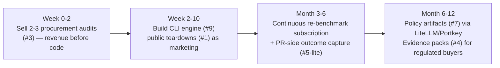

# 7. MVP Options & Scorecard

> Part of the [AI Dev Workflow Intelligence research report](./README.md).
> Ten candidate MVPs scored against the evidence from Sections 1–6. Scores 1 (bad) – 5 (excellent); higher is always better (so "Competitive intensity 5" = favorably empty field).

---

## 7.1 The scorecard

| # | MVP | Buyer urgency | Pain severity | Time-to-MVP | Tech feasibility | Data access ease | Trust burden (ease) | Differentiation | Competitive intensity (5=open) | Pricing potential | Expansion path | Not-a-feature risk (5=safe) | **Total /55** |
|---|---|---|---|---|---|---|---|---|---|---|---|---|---|
| 1 | Public repo benchmark demo / leaderboard | 2 | 2 | 5 | 5 | 5 | 5 | 2 | 2 | 1 | 3 | 2 | **34** |
| 2 | Private repo **benchmarkability audit** | 3 | 3 | 5 | 5 | 4 | 4 | 3 | 4 | 2 | 4 | 2 | **38** |
| 3 | **AI coding procurement audit** (service-led) | 4 | 4 | 5 | 5 | 3 | 3 | 4 | 5 | 4 | 5 | 3 | **45** |
| 4 | PR evidence / verification GitHub App | 3 | 4 | 3 | 3 | 3 | 3 | 3 | 2 | 4 | 4 | 3 | **35** |
| 5 | AI dev workflow observability dashboard | 3 | 4 | 2 | 3 | 2 | 2 | 2 | 2 | 3 | 4 | 2 | **29** |
| 6 | Open-model adoption & routing advisor | 3 | 3 | 4 | 4 | 3 | 4 | 3 | 4 | 2 | 3 | 2 | **35** |
| 7 | Routing policy generator (gateway-integrated) | 2 | 3 | 2 | 3 | 2 | 3 | 4 | 5 | 3 | 5 | 3 | **35** |
| 8 | Agent bakeoff harness (worktree orchestrator) | 3 | 3 | 5 | 4 | 4 | 4 | 1 | 1 | 1 | 3 | 1 | **30** |
| 9 | **Local-first benchmark CLI** (+ cloud reports) | 4 | 4 | 4 | 4 | 5 | 5 | 4 | 3 | 3 | 5 | 4 | **45** |
| 10 | Agency AI delivery QA / client evidence packs | 3 | 3 | 3 | 4 | 3 | 3 | 4 | 4 | 2 | 3 | 3 | **35** |

### Scoring rationale — the decisive rows

- **#3 Procurement audit (45):** the buyer research says this pain is budgeted *now* (90% adoption / 20% measurement; 2026 billing shocks; bakeoffs already happening informally). A service can be sold in week 1, prices against a $100k+/yr tool decision, and every engagement produces benchmark data + a design partner. Weakness: consulting gravity — mitigated by pairing with #9 from day one.
- **#9 Local-first benchmark CLI (45):** the technical research says it's feasible (4–8 weeks for a narrow slice); local-first kills the security objection that blocks SaaS competitors (Sigmabench requires repo access to their service); OSS-core matches how the community already adopts this category (codeprobe, RepoGauge). Weakness: episodic standalone use — mitigated by continuous re-benchmark subscription (model releases arrive ~weekly, making "renewal time" effectively quarterly or faster).
- **#5 Observability (29):** squeezed between DX/Jellyfish (own the buyer) and Helicone-class tooling (own the traces); attribution is only partial without gateway adoption. Build the *outcome-capture slice* as a feature of #9's continuous mode, not as the company.
- **#8 Bakeoff harness (30):** commoditized in real time (Cursor best-of-N, Conductor, Emdash, Claude teams). Scored 1 on differentiation and not-a-feature risk — **the wedge to avoid**, despite being fun to build. Its one salvageable asset (labeled comparisons from live bakeoffs) can be captured later as an integration.
- **#4 PR evidence (35):** right long-term thesis (verification budget, EU AI Act/CRA deadlines), wrong first move: the PR surface is the most contested real estate in the market (CodeRabbit at $40M ARR, GitHub native). Enter after benchmark credibility exists, framed as audit evidence (security budget) rather than review comments (crowded).
- **#7 Routing policy (35):** highest strategic value, strictly sequenced after eval data exists. Scores poorly on urgency *today* because the policy is only trustworthy once calibrated.

## 7.2 Recommendations by wedge

| Question | Answer | Why |
|---|---|---|
| Solo founder, 4–8 week prototype | **#9 CLI**, narrow (Python+TS, 3 agents), with #1 public teardowns as marketing | Fastest credible artifact; local-first trust; OSS distribution |
| 3–6 month serious build | **#9 + #3 combined**: CLI as engine, audits as revenue, continuous re-benchmark subscription as the product | The composite from [§6.4](./06_technical_architectures.md) |
| Best service-led wedge | **#3 procurement audit** at $15–50k | Sells before software; funds runway; paid discovery |
| Best enterprise wedge | #3 delivered on-prem via #9, expanding to #4 evidence packs for regulated buyers | Security budget > devtools budget; AI Act/CRA timing |
| Best agency wedge | #10 as a white-labeled report layer on #9 | Real pain, but secondary — self-serve tier, not focus |
| Best OSS/community wedge | #9's miner+runner core OSS (Apache-2.0), cloud history/reports paid | Category norm already (codeprobe/RepoGauge); trust flywheel |
| **Wedge to avoid** | **#8 bakeoff orchestrator** (commoditized) and #5 standalone observability (squeezed) | See rationale above |

## 7.3 The composite recommendation

This sequencing converts the two 45-point MVPs into one motion: the audit sells the CLI, the CLI industrializes the audit, continuous mode converts both into recurring revenue, and the accumulated eval+outcome data opens the policy and evidence expansions that neither gateways nor engineering-intelligence platforms can currently reach ([Section 3](./03_routing_vs_benchmarking.md)). Detailed plans in [Section 10](./10_validation_and_build_plans.md).
