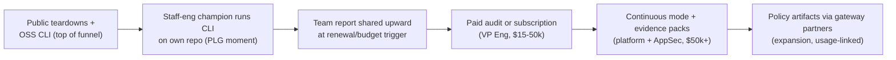

# 8. GTM & Business Model

> Part of the [AI Dev Workflow Intelligence research report](./README.md).
> Grounded in the buyer-side research: budget owners, trigger events, price anchors, and the funding environment.

---

## 8.1 Who pays, and from which budget

The research identified four buyer archetypes with materially different confidence levels:

| Buyer | Budget line | Confidence they'd pay | Evidence |
|---|---|---|---|
| **VP Eng / CTO under CFO ROI pressure** | Developer productivity / platform (the $50–120k/yr Jellyfish-class line), increasingly CFO-co-sponsored | **High** | 90% adoption vs 20% measurement; 2026 usage-billing shocks made spend variable and board-visible; DX's $1B exit priced this buyer **[HARD]** |
| **AppSec / GRC lead (regulated)** | Security budget — larger, less discretionary | **Medium-high** | "Frame it as security, not productivity, and budget approval is faster" (analyst guidance); EU AI Act Aug 2026, CRA Sept 2026; RFPs now demand audit trails, model pinning, AI BOMs **[MED]** |
| **AI-native startup CTO** | Eng tooling (self-serve) | Medium (willing, small ACV) | Highest per-eng AI spend; BYOK doubled to 36%; GLM/Kimi coding-plan adopters **[MED]** |
| **Agency delivery lead** | Project margin / COGS | Medium-low | 22% margin compression at hourly-billing agencies; needs client-facing proof artifacts **[MED]** |

**Who blocks the sale:** security review (repo access — neutralized by local-first execution), and the "isn't this DX/Copilot dashboard?" objection (neutralized by task-level capability evidence neither has). **Who champions:** the staff engineer already running a manual bakeoff.

**Trigger events that open budgets** (from the research, ranked by observed frequency):

1. A surprise AI bill or the June 2026 Copilot repricing landing in the CFO's inbox
2. A tool renewal / consolidation decision (Ramp data shows share churning 41%→26% in 11 months — renewals are now contested)
3. A major model release ("should we switch?") — arriving ~weekly
4. An AI-attributed incident or a failed agent rollout
5. An audit/compliance question about AI-generated code (accelerating into Aug 2026 EU AI Act)

## 8.2 Business model options evaluated

| Model | Who pays | ACV potential | Margin | Repeatability | Verdict |
|---|---|---|---|---|---|
| Paid benchmark/procurement audit | VP Eng | $15–50k/engagement | Service margin (~50–70%) | Quarterly-ish (model churn) | **Phase 0 revenue + discovery**; don't scale headcount |
| Per-repo benchmark subscription (continuous re-bench on releases) | VP Eng / platform | $6–24k/repo/yr ($500–2k/mo) | Software + compute pass-through | High (weekly model releases do the selling) | **Core recurring engine** |
| OSS CLI + paid cloud reports/history | Individual → team | Freemium → $99–499/mo team | High | High | **Distribution layer** feeding the above |
| Per-seat observability | VP Eng | $10–30/dev/mo | High | High | Don't sell standalone (DX/Jellyfish squeeze); bundle outcome capture into subscription |
| Per-PR evidence pricing | AppSec | $0.10–1/PR or $20–40/dev/mo | High | High | Phase 3; ride compliance deadlines; price against audit cost, not review cost |
| Routing fee (% of savings or per-token) | Platform | Usage-based | High | High | Phase 3+, via gateway partners; don't build a gateway |
| Self-hosted enterprise license | Regulated org | $50–250k/yr | High | Annual | Phase 3 SKU; the local-first architecture makes this nearly free to offer |
| Marketplace/partnership (LiteLLM configs, Not Diamond data, DX integration) | Partner-sourced | Rev-share | High | Medium | Cheap optionality; pursue LiteLLM first |

Anchors from the market: engineering-intelligence platforms clear $50–120k/yr; CodeRabbit proved $12–30/dev/mo clears procurement friction-free; Devin proved enterprises pay $500/seat when value is legible; a $100k tool decision comfortably supports a $25k evidence engagement **[MED/HARD]**.

## 8.3 Market size and venture math

Bottom-up inputs **[MED unless noted]**:

- 36.5M professional developers (SlashData **[HARD]**); AI code tools market $7.4–8.3B (2025) → $22–30B by 2030 at ~26–28% CAGR
- Measurement/verification adjacent markets today: AI code review ~$0.4–0.6B narrow / $2–3B broad; LLM observability $2.7B → $9.3B by 2030; SEI platforms (DX-class) mid-hundreds-$M
- Serviceable market for "repo-specific evidence + policy": realistically the ~50k orgs worldwide with 50+ engineers and material AI spend. At $20–60k blended ACV and 2–5% share in 5 years → **$20–150M ARR range** — a solid B2B outcome, venture-scale only if the policy/control-plane expansion lands (that's where $1B+ outcomes live, per the DX and Braintrust comps)
- Timing: **not too early** (billing shocks + AI Act make 2026–27 the budget-forming years; Sigmabench/Stet prove demand exists now) and **not yet too late** (no dominant player; the join is unowned). The 12–18 month land-grab window from [§2.5](./02_competitive_landscape.md) applies.

**Is it venture-scale?** Honest answer: as a benchmarking tool, no — as the calibration/evidence layer that gateways, EI platforms, and compliance regimes all need, plausibly yes. The venture story requires the data flywheel (cross-repo calibration + outcome joins) to compound. A bootstrapped/services-to-SaaS path is fully viable at the $3–10M ARR scale without that flywheel — which de-risks the founder's downside. Medium confidence.

## 8.4 Sales motion

- **Motion:** product-led bottoms-up (OSS CLI) + founder-led top-down (audits) simultaneously; they converge on the same artifact — the report.
- **Positioning to test** (from [§9](./09_strategic_synthesis.md)): "Know what your AI tools can actually do on your code" (procurement frame) vs "Evidence for every AI-written change" (verification frame). The research says lead with the first (budgeted now), hold the second for the AppSec expansion.
- **Pricing experiment for the 30-day plan:** offer the pilot audit at $5–15k, below most companies' procurement-review thresholds, to maximize learning velocity ([§10.1](./10_validation_and_build_plans.md)).
- **Likely objections and answers:** "we'd build it ourselves" → the hardening (anti-reward-hacking, env setup, statistics) is 80% of the work and invisible until it bites; "our repo is special" → that's the product's whole premise; "isn't this DX?" → DX tells you usage and throughput, not which tool passes your tests at what cost; "security review" → code never leaves your machines.
