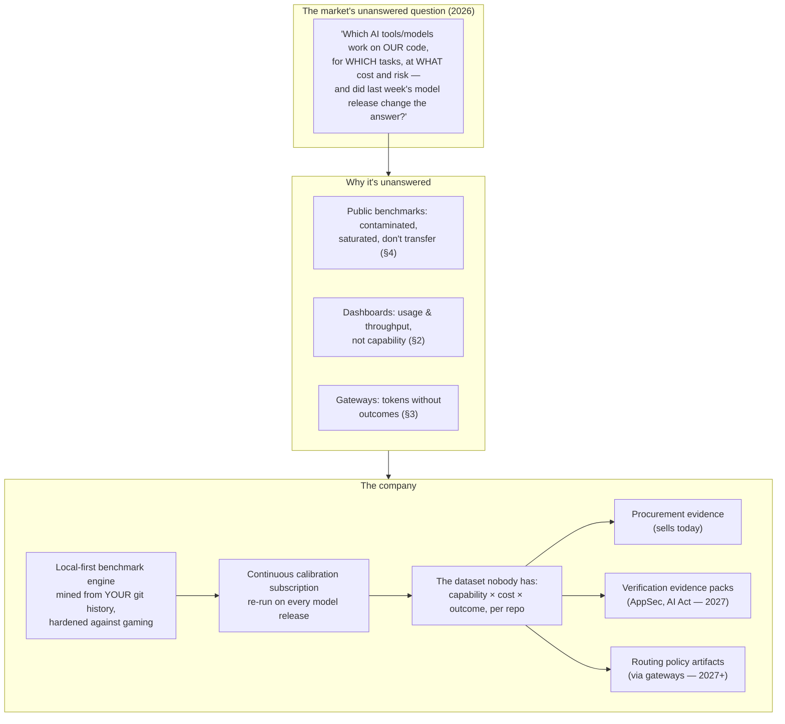

# 9. Strategic Synthesis: The Optimal Product Thesis

> Part of the [AI Dev Workflow Intelligence research report](./README.md).
> This is the analyst's own conclusion — deliberately tested against, not derived from, the initial thesis.

---

## 9.1 Verdict on the initial hypothesis

The initial internal hypothesis was:

> The strongest wedge may be an evidence/calibration layer: repo-specific benchmarking + procurement recommendations + workflow observability + verification evidence, with routing later.

**The research substantially supports this — with four corrections:**

1. **The category is no longer empty.** Sigmabench, Stet, RepoGauge, codeprobe, Vals, and Factory's Agent Readiness all shipped in 2025–26. The thesis survives because none has team/enterprise dominance, the local-first + continuous + outcome-join composite, or the buyer relationship — but "we invented repo-specific benchmarking" is not available positioning. Speed matters more than the original thesis assumed.
2. **Observability should not be a standalone pillar.** DX ($1B exit to Atlassian), Jellyfish, LinearB own the org-metrics buyer; Helicone-class tools got absorbed. The defensible slice is narrow: joining *task-level capability and token spend* to *change-level outcomes* — as a feature of the benchmark subscription, not a dashboard product.
3. **Routing is even more clearly "later" than assumed** — but also more clearly *valuable* later: coding is now >50% of gateway traffic, routing research has pivoted to execution-verified/step-level methods, and no commercial player has the labeled data. The benchmark product manufactures exactly that data. Partner with LiteLLM/OpenRouter/Not Diamond; never build a gateway.
4. **Verification/evidence is the bigger long-term prize than procurement** (security budgets + EU AI Act/CRA deadlines + the 69%-of-agent-decisions-need-human-verification reality), but it's the *second* act — the PR surface is crowded and the compliance market rewards incumbency and certifications a new company won't have on day one.

## 9.2 Direct answers to the eighteen strategic questions

1. **Strongest version of the idea:** a **calibration company** — local-first repo benchmarking engine that (a) sells procurement evidence today, (b) accumulates the only dataset joining task-level capability, token cost, and merge outcomes per repo, and (c) monetizes that data as verification evidence and routing policy through partners. "The evidence layer for AI-assisted engineering."
2. **Weakest version:** a generic bakeoff orchestrator or public leaderboard site — commoditized by IDE-native best-of-N and content-farm comparisons respectively.
3. **Definitely don't build:** a gateway, an AI IDE, another PR review commenter, browser-automation benchmarking of GUI tools, or the full control plane first.
4. **First segment:** AI-forward companies with 50–500 engineers already paying for 2+ tools, with a staff-engineer champion and a VP under ROI pressure. (Regulated enterprises second; agencies self-serve later.)
5. **First MVP:** paid procurement audit (week 0) + local-first benchmark CLI (weeks 2–10), per the [scorecard](./07_mvp_options_scorecard.md).
6. **Name/positioning:** position as *evidence/calibration*, not "benchmarking" (which sounds like leaderboards) — e.g., working name in the spirit of "RepoProof" / "Calibrate". Naming matters less than the category phrase: **"repo-specific evidence for AI engineering decisions."**
7. **Homepage headline to test first:** *"Know which AI coding agents actually work on your codebase — before you standardize, and every time the models change."*
8. **Key wedge:** the procurement/renewal moment, entered through a champion-run local CLI.
9. **Expansion path:** audit → CLI → continuous re-benchmark subscription → outcome capture → evidence packs (AppSec) → policy artifacts (gateways) → de facto control-plane data layer.
10. **Top 10 risks:** (1) Sigmabench/Stet win the land-grab first; (2) Atlassian/DX bundles "good enough" capability scoring; (3) GitHub ships native provenance + eval, absorbing the evidence story; (4) frontier models get so good that per-repo variance collapses and "just use Claude" wins; (5) mining yield too low on messy enterprise repos (the 7–29% env-setup reality); (6) episodic demand never converts to subscription; (7) consulting gravity; (8) agent vendors close off headless/automation surfaces; (9) model-price collapse mutes the cost half of the pitch; (10) solo-founder bandwidth vs. a composite product.
11. **What would falsify the idea:** ≥50% of validation interviews saying vibes + public benchmarks + a 2-week pilot are good enough; paid-audit conversion of 0/10 with price not the objection; mining yielding <10 usable tasks on most target repos; per-repo agent rankings turning out stable across repos after all (contradicting the 30–60% variance data); DX/GitHub shipping the join within the validation window.
12. **Next 30 days:** the [validation sprint](./10_validation_and_build_plans.md) — 20 interviews, 2 public teardowns, 10 paid-audit offers, pre-registered kill thresholds.
13. **Weeks 4–8:** CLI v1 (Python+TS, Claude Code/Codex/Aider adapters, hardened harness, assess+mine+run+report).
14. **Months 3–6:** continuous mode, cloud history, first outcome-capture GitHub App, 2 design partners, SOC2 track.
15. **Defer:** routing policy generation (until eval corpus exists), evidence packs (until credibility exists), self-hosted SKU, GitLab, IDE-fidelity work.
16. **Company, feature, consultancy, or infrastructure?** A company *if* the data flywheel compounds; otherwise a very good $3–10M ARR bootstrapped business or a natural acquisition for Atlassian/DX, Qodo, or a gateway. All three outcomes are acceptable from the same starting wedge — which is the point of choosing it.
17. **Compete with or integrate with Not Diamond/LiteLLM/OpenRouter?** Integrate. They own traffic; this owns ground truth. The policy artifact is the bridge (and Not Diamond is a plausible acquirer/partner for the routing act).
18. **Optimal solo-founder path:** sell audits immediately (revenue + discovery), build the CLI as OSS-core (distribution + trust), publish teardowns relentlessly (the marketing IS the product demo), convert audits to subscriptions at month 3–4, raise (if at all) only once the subscription motion shows retention through 2+ model-release cycles.

## 9.3 The one-diagram thesis

**Final confidence statement:** High confidence the pain is real, budgeted, and durable; high confidence the technical approach is feasible with known hard parts; medium confidence this specific composite wins the land-grab against fast-moving neighbors; medium confidence on venture scale (bootstrap-viable regardless). The single most important next action is not building — it's the 10 paid-audit offers in the next 30 days, because conversion on those collapses most of the remaining uncertainty.
