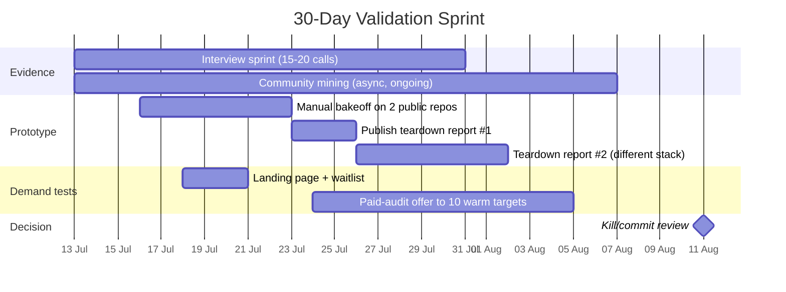
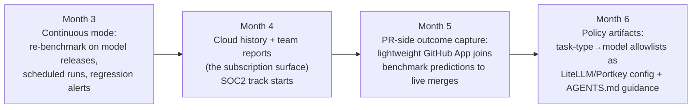

# 10. Validation Plan, Build Plans & Customer Discovery

> Part of the [AI Dev Workflow Intelligence research report](./README.md).
> Assumes the recommended wedge from [Section 9](./09_strategic_synthesis.md): paid procurement audits → local-first repo benchmark CLI → continuous evidence & policy layer.

---

## 10.1 The 30-day validation plan

Objective: **spend ≤ 30 days and ≈ $0 to learn whether anyone pays**, before committing the 4–8 week build.

### Week-by-week

**Week 1 — instrument the demand signal.**
- Ship a landing page: headline test between (a) "Know which coding agent actually works on your codebase" and (b) "Evidence for every AI-written change". Two variants, one waitlist, UTM-tagged outreach.
- Book interviews (targets below). Ask for 25 minutes, offer the eventual benchmark report as compensation.
- Start the manual bakeoff: pick 2 well-known OSS repos (one Python, one TS), mine 10 tasks each by hand from merged PRs, run Claude Code / Codex CLI / Aider(+GLM or Kimi) headlessly, score with held-out tests.

**Week 2 — publish and provoke.**
- Publish teardown #1: "We ran 3 coding agents on {repo}'s last 10 real bugs. Here's who won, what it cost, and where they all failed." Post to HN/Reddit/X. This is simultaneously a demand test, an SEO asset, and a recruiting magnet for design partners.
- Continue interviews; begin coding transcripts against the falsification criteria in [Section 9](./09_strategic_synthesis.md).

**Week 3 — ask for money.**
- Offer a **paid pilot audit ($5–15k, scoped to one repo, 2-week turnaround)** to the 10 warmest contacts. The price is deliberately below procurement thresholds that trigger legal review at most mid-size companies.
- The ask itself is the experiment: objections ("we'd need security review", "who else has done this?", "can it run on-prem?") are the product requirements list.

**Week 4 — decide.**
- Kill/commit against pre-registered thresholds (below). Write the decision memo either way.

### Pre-registered decision thresholds

| Signal | Commit if | Kill/pivot if |
|---|---|---|
| Paid audit conversions | ≥ 2 of 10 offers accepted | 0 of 10, with price never the stated objection |
| Interviews expressing budgeted pain | ≥ 6 of 20 name an owner + budget | ≤ 2 of 20 |
| Repo access willingness | ≥ 50% would run a local CLI | Majority refuse any form incl. local |
| Teardown traction | ≥ 5k uniques or ≥ 20 qualified waitlist | Crickets on both posts |
| "Already solved" rate | < 25% say existing tools suffice | > 50% point to a specific incumbent |

---

## 10.2 Customer discovery plan

### 20 customer interview targets (archetypes, with why)

| # | Archetype | Why them |
|---|---|---|
| 1 | Head of DevEx/platform, 200–2,000-eng company already paying for ≥2 AI tools | The thesis buyer — owns the consolidation decision |
| 2 | VP Eng at Series B–C AI-native startup (50–150 eng) | Highest AI spend per engineer; feels cost pain monthly |
| 3 | CTO of 20–50-person agency delivering client code with AI | Needs to *prove* quality to clients — evidence buyer |
| 4 | Staff engineer running an internal Copilot-vs-Cursor bakeoff | Doing the job manually today; would use the tool tomorrow |
| 5 | AppSec lead at a fintech using coding agents | Verification/evidence budget holder |
| 6 | Eng manager who just got an AI usage-based bill 3× estimate | Cost-pain moment |
| 7 | Platform lead mid-rollout of LiteLLM/internal gateway | Routing-policy consumer |
| 8 | Open-source maintainer drowning in AI PRs | Review-burden extreme case (curl, tldraw-type projects) |
| 9 | Director of eng at a bank/insurer piloting agents under compliance constraints | Regulated wedge test |
| 10 | Founder using GLM/Kimi coding plans to cut costs | Open-model routing early adopter |
| 11 | DX/Jellyfish/LinearB power-user (eng-metrics owner) | Tests "isn't this just DX?" objection |
| 12 | Eng leader who **rejected** AI tools after a pilot | Falsification interview — why did evidence not matter? |
| 13 | Consultant/SI partner advising enterprises on AI adoption | Channel + competitor-for-audits |
| 14 | QA/test-eng lead where AI writes most new tests | Weak-oracle pain |
| 15 | Monorepo platform owner (5M+ LOC) | Context/scale edge case for task mining |
| 16 | Eng leader at a company that standardized on ONE tool | Why? What evidence closed the decision? |
| 17 | Procurement/vendor-management person who ran an AI tool RFP | The actual paperwork reality |
| 18 | Claude Code Max power-user hitting weekly limits | Subscription-vs-API economics |
| 19 | Eng leader with a failed autonomous-agent rollout (rolled back) | What evidence would have prevented/predicted it |
| 20 | CTO who bought CodeRabbit/Bugbot then churned | PR-surface saturation test |

### 10 expert interview targets

SWE-bench/SWE-smith authors (task-mining feasibility) · METR researcher (measurement design) · DORA report author (AI amplifier thesis) · DX researcher (Abi Noda's team — AI measurement framework) · a LiteLLM/OpenRouter engineer (gateway data reality) · a Sigmabench/Stet founder if they'll talk (category intel) · an Anthropic/OpenAI enterprise SE (what enterprise buyers ask for) · a CodeRabbit/Greptile PM (review-noise economics) · an EU AI Act compliance lawyer (is AI-code evidence actually required?) · a VC who has looked at 5+ eval startups (why they passed/invested).

### Communities to mine (10)
r/ExperiencedDevs · r/ChatGPTCoding · r/LocalLLaMA · r/cursor + Cursor forum · Claude Code GitHub issues + r/ClaudeAI · Hacker News (search: "coding agent", "SWE-bench", "AI code review") · LiteLLM & OpenRouter Discords · Aider Discord · Rands Leadership Slack (#ai channels) · LeadDev / DX communities.

### Search queries that surface the pain (GitHub/Reddit/LinkedIn)
"which AI coding tool" site:reddit.com/r/ExperiencedDevs · "Cursor vs Claude Code" team standardize · "AI code review" noise OR useless · "cost per" AI coding spend justify · repo:anthropics/claude-code "rate limit" · "AGENTS.md" best practices testing · LinkedIn: "evaluating AI coding tools" title:(platform OR DevEx) · "shadow AI" developer policy · "SWE-bench" "our codebase" · "benchmarked" "on our repo" agents.

### Question banks

**For AI-native startup CTOs (10):**
1. Walk me through the last time you changed AI coding tools or models — what triggered it?
2. What did that evaluation actually consist of? (Listen for: vibes vs data)
3. What's your monthly AI dev-tool spend? Who sees that number?
4. Have you ever been surprised by a bill? What happened next?
5. What tasks do you *not* let agents touch? Written down anywhere?
6. If a report told you model X does your bug-fix backlog at 40% of the cost — what would you do with that, concretely?
7. Would you run a CLI that benchmarks agents on your repo locally? What would block it?
8. Have you tried Qwen/GLM/Kimi/DeepSeek for anything? Officially?
9. Who reviews agent-written PRs, and has review load changed?
10. What would you pay $500/mo for in this space? $5k/mo?

**For platform/DevEx leaders (10):**
1. How many AI dev tools are in use — sanctioned and not? How do you know?
2. What did your last AI tool procurement look like? Duration, criteria, who signed?
3. What are you reporting to leadership about AI ROI today? Are they satisfied?
4. Do you distinguish AI-authored changes in your metrics? Could you?
5. What's your model allowlist story? Who maintains it, how is it enforced?
6. Where does the "AI tools" budget line live and how big is it per engineer?
7. If you had per-repo evidence of which tool works where, would rollout decisions change?
8. What compliance/audit questions about AI code have you already been asked?
9. What breaks first when agent usage 10×es — review, CI, security, cost?
10. Buy vs build: you clearly *could* build a bakeoff harness. Why haven't you / did you?

**For agencies (10):** How do you bill AI-assisted hours? · Do clients ask what AI touched their code? · Has AI changed fixed-bid margins? · Any client audits of AI usage? · Would a per-project "AI quality evidence pack" win deals or spook clients? · What tools per team and who decides? · Cost pass-through or absorbed? · Junior training impact? · Liability language changes in contracts? · Would you white-label a benchmark/evidence report?

**For security/compliance stakeholders (10):** What's your policy on agent repo access today? · What evidence would you require to expand it? · Is AI-generated code flagged in your SDLC audits? · SOC2/ISO auditor questions about AI yet? · EU AI Act exposure assessment done? · Who signs off on a new model/provider? · What would a "verification pack per PR" need to contain to be usable in an audit? · Have you blocked an AI tool — why? · Data-egress requirements for any repo-touching tool? · Budget line for AI governance in FY27?

---

## 10.3 The 4–8 week build plan (post-validation)

Scope: the local-first benchmark CLI (Architecture A from [Section 6](./06_technical_architectures.md)), narrow and honest.

| Week | Deliverable | Risk being retired |
|---|---|---|
| 1–2 | Capsule format + runner for **one** ecosystem (Python/uv/pytest) + Claude Code & Codex CLI adapters, worktree isolation, cost/latency capture | Can we run agents headlessly, reproducibly, cheaply? |
| 3–4 | Task miner v1: merged-PR mining with execute-both-sides validation; `assess` command scoring repo benchmarkability; human review UI (TUI is fine) | Is auto-mining yield ≥ 10 good capsules on real repos? (The #1 technical risk) |
| 5 | Report generator: pass rate, cost/solve, consistency across trials, per-directory breakdown; markdown + HTML artifact | Is the output legible to a VP without hand-holding? |
| 6 | Aider or OpenCode adapter (opens open-model comparisons: GLM/Kimi/Qwen via OpenRouter); TS/pnpm ecosystem | Does the multi-model story hold? |
| 7–8 | Run against 2 design-partner repos (from audit pipeline); fix what breaks; publish public leaderboard on 3 OSS repos as marketing | Does it survive contact with messy real repos? |

Non-goals for v1 (write them down, resist them): GUI, cloud execution, >2 ecosystems, GitLab, routing integration, PR bot, provenance capture.

## 10.4 The 3–6 month roadmap

Revenue shape by month 6: audits ($15–50k each, 1–2/mo) funding runway; CLI free/OSS-core; team subscription ($500–2,000/repo/mo, continuous re-benchmarking + history) as the compounding line; first enterprise design partner for the policy layer.

**Defer until later:** self-hosted enterprise SKU, GitLab/Bitbucket, IDE-tool fidelity work (Cursor GUI), security-review benchmark packs, the full control plane. Each is real, none is first.
