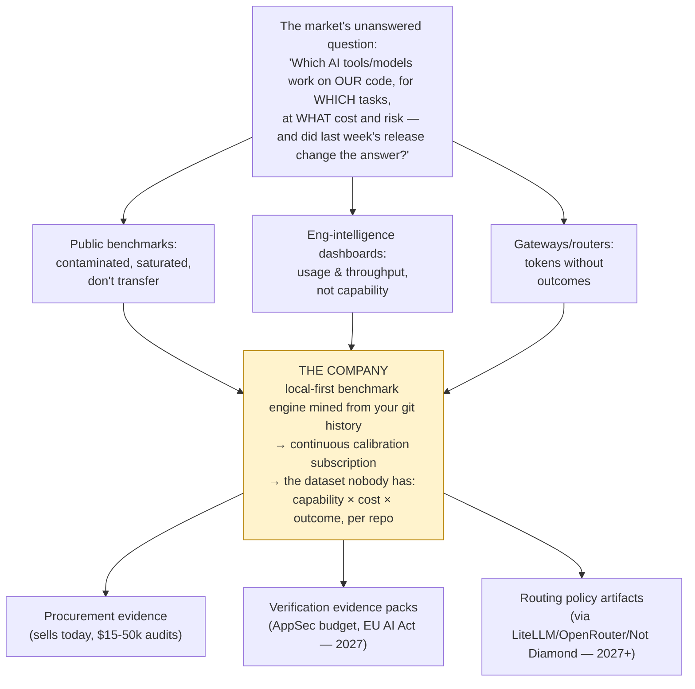

# AI Developer Workflow Intelligence — Deep Research Report

**Repo evals · Routing · Verification: is there a business here, and what should be built first?**

Research date: July 5, 2026 · Method: ~90 web searches across five parallel research workstreams plus direct analysis · Written for a founder deciding whether and what to build.

---

## The answer, in three lines

1. **Yes, build — as a calibration/evidence company**: local-first repo benchmarking that sells procurement evidence now and compounds into verification evidence and routing policy.
2. **The unowned asset** is the join between task-level capability, token-level spend, and git/PR/CI outcomes — gateways, dashboards, and benchmark startups each hold one corner, nobody holds the join.
3. **The window is 12–18 months**: direct competitors (Sigmabench, Stet, RepoGauge) launched within the last year, and Atlassian/DX owns the buyer. Validate with 10 paid-audit offers in the next 30 days before writing serious code.

## How to read this report

| # | File | What it answers |
|---|---|---|
| 0 | [Executive summary](./00_executive_summary.md) | The 20 highest-signal findings and condensed action plan |
| 1 | [Market reality & pain](./01_market_reality_and_pain.md) | Is the problem real? Who hurts, how much, is it budgeted? (adoption/trust data, billing shocks, review-burden crisis, pain-by-segment matrix) |
| 2 | [Competitive landscape](./02_competitive_landscape.md) | Category map, 15-player competitor matrix, consolidation wave, white-space analysis, incumbent kill-risk |
| 3 | [Routing vs benchmarking](./03_routing_vs_benchmarking.md) | Is generic routing enough? (No — wrong unit, wrong feedback loop, wrong layer; and routing barely monetizes. Partner with gateways.) |
| 4 | [Benchmarking feasibility](./04_benchmarking_feasibility.md) | Why public benchmarks died 2025–26; how repo-specific evals are actually built; the three honest constraints; what's enough for procurement |
| 4b | [Open & alternative models](./04b_open_models_landscape.md) | Open/Chinese-origin/local model adoption reality; what breaks in agentic use; cost deltas; the compliance bifurcation |
| 5 | [Task taxonomy & risk model](./05_task_taxonomy_risk_model.md) | Risk×verifiability quadrant, full task taxonomy, safe/maybe/unsafe heatmap, mechanical risk classifier |
| 6 | [Technical architectures](./06_technical_architectures.md) | Seven architectures (A–G) evaluated; capsule format; fair-comparison protocol; data model; recommended phasing |
| 7 | [MVP scorecard](./07_mvp_options_scorecard.md) | Ten MVPs scored on 11 dimensions; winners (procurement audit + local-first CLI, 45/55 each) and the wedge to avoid (bakeoff harness) |
| 8 | [GTM & business model](./08_gtm_business_model.md) | Buyers, budgets, trigger events, pricing anchors, market size, venture math, sales motion |
| 9 | [Strategic synthesis](./09_strategic_synthesis.md) | The analyst's own thesis; direct answers to all 18 strategic questions; the one-diagram thesis; falsification criteria |
| 10 | [Validation & build plans](./10_validation_and_build_plans.md) | 30-day validation sprint with pre-registered kill thresholds; full customer-discovery plan with question banks; 4–8 week and 3–6 month build plans |
| 11 | [Appendices](./11_appendices_sources.md) | Method, source tables by topic, claims flagged for re-verification, open questions |

## The thesis in one diagram

## Confidence summary

| Conclusion | Confidence |
|---|---|
| The pain (measurement/verification/procurement) is real, budgeted, durable | **High** |
| Public benchmarks are insufficient for procurement; repo variance is decision-relevant | **High** |
| Generic routing cannot substitute for repo-specific evidence | **High** (technical), **Medium-high** (commercial) |
| The technical build is feasible with known hard parts (env setup, oracles, anti-gaming) | **High** |
| This specific composite wins the land-grab vs Sigmabench/Stet/DX | **Medium** |
| Venture-scale outcome (vs excellent bootstrap) | **Medium** — requires the data flywheel |

*Raw research-agent outputs (per-workstream reports with full sourcing) are preserved in [`_raw/`](./_raw/).*
